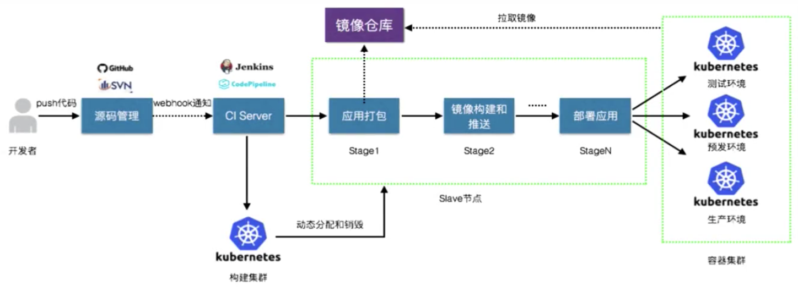

* content
{:toc}
> It's only after we've lost everything, that we're free to do anything 
>
> 只有我们失去了一切，我们才能随心所欲的做事情
>
> 《搏击俱乐部》

# 20241027

一瞬间一个月就过去了，10月一下子变得超级忙。

9月底一直在为标准化文档操心，逼着搜集了好多材料，勉强整理出来了一些可以用的文档，然后10月各种会上宣讲。

10月就是各种活动，本来加上国庆时间就有点少，活动还很多，每个活动要讲的内容还不太一样，即使同一个话题也需要微调，总之感觉每天都要干活。

上周算是最忙的一周，每天都要整理材料，然后讲，然后继续整理后发过去，周末强迫自己不要去想这些， 放在周内去完成。周六下午的时候，刷到了同事们加班办活动的照片...感觉即使自己不卷，别人会推着你卷...

和Sales聊了下，Commercial市场还是需要自己人，总代以及partner的水平sales实在是不敢用，10月初专门办了个活动让总代讲，我个人是感觉有点尬（就是讲的人没多少演讲经验），不过老板觉得还是可以培养，sales和我感觉类似，听不下去...

去西藏的照片还没来及整理。

话说回来，干什么事情取决于自己，我觉得是时候多输出一些东西了。

# 20240922

快速过完三天工作日，来到了期盼已久的周末（上个周末内耗太严重了，严重虚脱）。

看剧两个小时左右就很累了，躺下来休息一会儿，开始总结周五的 1on1 内容。

不要对自己有太高的要求，有多少时间/精力干多少活，不逼自己。

看到某博主拆电池的视频，下面的评论让我想起鲁迅弃医从文的事，可能无论哪个国家哪个时期都有反智的人吧，面对这些人需要克制，不理论，随他。

# 20240915

又是三周，休假归来，还没来及写游记，连着忙了两周。

上次玩币，经历一些短期波动，终于所有的收益都没了，发现还是没有什么短期策略是100%稳固的，或者说，短期就是短期，赚了就跑，每次小金额做多次就行，千万不能贪。

关了账号两周多，后来还是打开了，好家伙，几乎同样的策略，一笔亏0，另一笔260%的收益，也不知道是不是保证金没留够还是什么，一直有收益的这个就放着不动吧，如果按照这个收益，预计得两年回本 ORZ...还是跟着朋友做空吧。

工作上，公司新的组织架构出来了，存在很多不确定，一开始还挺焦虑，要做很多文档和培训，后来慢慢发现，其实公司策略和现实有点差别的，现实并没有那么着急...而且其他同事也提供了不少好的文档，只需要花点时间看看，然后更新下就行。

老板让我带个人，一开始其实不知道咋带，因为我自己有时候也不知道干啥，更别说让别人来帮我。不过后来聊着，发现还是可以去指导他的，虽然工作时间不长，但是经常会有些疑问，比如什么缩写是什么名字，为什么要有某些东西等等。现在在外企从来都没有带新人的文化，即使有 Mentor，也只是粗粗的指导下，不会有系统性的培训。对于老板让带的新人，他们会有系统的技术培训，不过其他的都没有，所以想着从组织架构、项目流程等角度去培训培训吧，同时自己也思考整理一下。

昨天有个不咋记得的朋友电话我介绍个生意，对方是个做国企的销售，曾经在国内的安全公司待过，和他讲了讲 PA 的产品，然后意识到，原来真的有很多名词并不是人人皆知，甚至一些比如容器、VM 这种技术也不知道，感觉真的可以写很多这种简单的科普。另外，聊到平台化时，他也直呼厉害，因为国内安全公司都是把一个个功能做成一个个硬件，而我们反其道行之，一个硬件通过订阅开启多个功能，延迟降低、管理成本也降低。可能就是自己一直在里面很熟悉一些东西，但是别人不一定有这样的认知。

写了个 Homelab 的文章，没想到系统推荐挺给力，3k 的阅读了，所以真的就是普适性越高的文章，阅读量会越高，也行吧，偶尔写写这种不费脑细胞的文章，认识认识新朋友也挺好。

周内有次偶尔抑郁了，大概率是前一天下午讲东西说了两小时大脑兴奋，晚上又玩了两小时游戏精力耗完了，第二天心情严重低落。不过午饭后睡了一觉后，下午还好，起来做了些实验，一切继续。

参加了两次 Dell 的会，每次规格都挺高（拉着我们出赞助），有些怀念 VM 的日子，SE 的大会上讲的东西都比较 High Level，会请相关行业的人来分享东西，然后会从上至下去讲底层（比如生命科学在研究什么，用到了什么技术等等）。

# 20240824

一下子三周了，开始玩币，精力消耗的挺多的，平均每天要花一个小时，看 19 次手机...

也不知道是不是事情太少，又开始想的有点多，感觉好多事情要干，干不完，学不动，异常的消极。玩币之类的真的就成了工作的调节剂。

开始背单词，每天其实只需要几分钟，熟悉熟悉各种单词，真的要学习还是需要记笔记反复的背诵，否则平时不使用忘的会比较快。

上周末好像就总结了下币相关的东西， 然后精力不支躺平了，再往前，好像刷剧？不去记录这些真的时间匆匆就流逝了。

周内应该都在写 SD-WAN 相关的东西，好不容易把想学的都学完，做了实验，写了 PPT，开心，就差一些 POC Guide 了，感觉应该让做项目的人去做，我可以坐收成果，哈哈。

# 20240804

写了一周的 PPT，逼着自己做了各种实验，周末就累趴了（或许是松弛过渡，身体真的松弛了）。

看了一点点书，《独角兽项目》的最后，看到了以外部视角去看业务的重要性，也就是说，一个东西能给客户带来什么，这才是应用需要关注的，然后去想如何实现。

接着看了点《跨越鸿沟》 ，原来市场的客户也是分类型的，之前从没意式到，只知道一些新产品不好推，就像曾经做的一些产品始终没能成为大众产品，看了这本书有一些概念了，原来客户就是分这么些类型，先采用新技术的就两类人：

创新者和早期使用者，创新者就如其名，喜欢以创新来做同行的领先者。早期使用者则可以从前沿的产品看到能给自己带来的利益。

早期使用者的需求可能并非定制化的，而是想让产品尽量对自己有利，所以产品可能会和客户预期有些偏差，但这并不意味着生意没办法做，这类客户可以接受产品的一些小瑕疵，只要偏差不是太大。

# 20240721

连着两个周末都在轻松和愉快的状态下度过，上周末还是逼着自己玩了下 LLM，结果真的比想象中的简单太多了，开源的力量真的好强大，各种工具让部署已经零门槛，生态里面，各种应用的部署也比想象的简单，有容器化直接跑起来的，有 pip 安装的，AI 就已经是个触手可及的应用了（前提是有资源）。

上上周五和 DELL 开会，没讲多少，但是显然讲之前的训练是挺有用的，比较好地整理了思路，会后同事喝多了，说了很多话，什么这种活动我讲比较合适，因为有些吹公司的话他也不好讲，毕竟是在别人的场子。又提到现在工作就是为了公司（而非钱）这类话，如果公司都没了，个人还有什么，当然这也是事实，或许上次去安吉车上聊的一些话触动了他吧，虽然我也没咋说过，不过心里默默还是想着把手下的活干好，先从自我改变做起吧。

整个周内基本都在玩 AI，玩下来会发现整个体系过于庞大，外人估计也只能玩玩应用的皮毛，不过这些皮毛我感觉也够用了。

现在的感觉是，AI 就是个工具，对于员工来说可以提高效率，企业的责任是为员工付费购买合适的 AI 服务，这就类似于公司为员工购买电脑、办公软件之类的。

对于个人来说，尤其是个人创作者来说，AI 也可以拿来提升效率，写作、翻译、编码、做视频等等都是有挺好的东西。

对于应用开发来说，一方面 AI 可以加速开发，另一方面，也可以通过 AI 来实现某些功能，比如看到一个用 AI 来把用户输入的姓名电话地址转换成有格式的 json，这个真的就是意向不到，但又相当合理的应用。

周五 CrowdStrike 出了个事，content update 触发了 bug，全球 800w 台 windows 机器可能受到影响，CS 的股价收盘跌了 11% 左右。这个事其实有些匪夷所思，一个 Content Update 看似无害的东西，直接搞崩了 windows 内核，估计是历史遗留原因，架构上 CS 基于内核态，本就存在风险，但是 CS 做的比较早，后期一些 ebpf 等技术出来，也很难再更换技术路线，所以沿用着一个“高风险”的架构。

这个事之外，是一大堆蹭热点的媒体，国内各种公司说自己没这类问题等等，做宣传，有些人还甚至都没有提 CS 这两个字，追捧国产化等。联想到了《夜行者》，媒体上，总会有些人觉得平凡的故事没什么了，真实的报道没什么意思了，开始吃人血馒头了。

公司让我带带实习生，初一听，感觉有点难度，因为我自己要么在杂事中忙的焦头烂额，要么闲的不知道干啥，带他们去参加啥代理商活动，不太可行。不过和同事 K 聊了下发现，其实能干的事情很多，尤其是在中文文档库层面，想象也是，我们缺：

- 曾经以产品线为主的一系列售前售后文档，现在可能都是零散的分散在各个地方，有些甚至都是没有的
- 现在用 Excel 整理，也感觉有一丢丢乱，Sales 一堆，SE 一堆，其实这些应该都属于同一个类型才对
- 缺少竞品的整理
- 缺少安全事件的整理，最好安全事件可以和一些产品方案有关联，比如 DevSecOps 等，这样以后市场活动能讲的东西也多一些

这周末，逼着自己拿出来《独角兽项目》，到了最后，作者一下子列了一堆数字化转型为企业带来的收获，其中还提到了机器学习，一下子就和最近看的 AI 内容结合起来了，此处记录一下：

- 通过对视频进行机器学习，分析用户在货物架哪些地方停留比较久，以此来看应该在哪些地方摆放价值收获可以更高的物品（这不就是聚类分析）
- 通过汽车标准的传感器去分析设备零件的寿命，提前预警。在提前预警的基础上，可以给用户提供上门服务
- 客户群体分析，比如车队或者开快车等人会比较关心车的寿命问题，因此提供的一些预警方案对他们来说价值很大

# 20240710

周末终于完成了 V 记的文章，连着周日周一周二都是各种被转发，也收获各种意外，炸出来不少曾经的人，有祝福的，有发现同好的，有感同身受的，感觉一切都值得了。

和一个重庆的 PSO 的聊了下，感觉都忘记一些当时的细节了，我写的还算委婉，真实情况可能更加不那么让人舒服...

上周开完会后一堆事情要做，老板又要把 SE Training 提上日程，需要准备 AI 的东西，自己 PAC External 的东西也没弄完，SD-WAN 的东西也没弄完，技术文章也没总结完，Cortex 实验没做完，感觉每个事都像是没空弄了。

# 20240703

开 allhands，感觉大家都喜欢做超级巨单，昨天还觉得 aqua 国内一个代理商就能做 2m 的单子，觉得挺多的，今天听到其实好多销售一个项目就能卖这么多，这么看来，确实会看不上容器安全这一小块的内容，那么再回来，这部分生意是不是可以直接找相关的 Partner 来搞？

# 20240630

试用期最后一个月，如老板所说，前面的时间是让我来学习的。

出差的效率真的是很低，如果本地两天可以干四件事，出差就只能干两件事...和 Dell 联合举办了一个会（准确的说是我们出的钱），然而有些 Session 被 Dell “劫持”，变成了他们的主场，可能大公司就是有这样的习惯吧。

在讲东西之前，提前演习了一点，努力的控制让自己说话不要那么快，要么容易卡壳，然而讲的时候还是有些地方卡了，不过相比上周六的感觉好多了。会后最后一个环节是圆桌讨论，同事 Leo 也太干练了，很容易就能把一个技术的问题上升到一定高度，什么“时间”+“空间”，时间表示做安全要事先安全，要么怎么叫做“防”；空间，IT 的人员数量有限的，怎么在有限的资源下高效处理各种安全事件，这是公司可以帮到的。一直想着把复杂的东西简单化，路漫漫。

周五开了个短会，要合作做 EBC（我也不知道是啥缩写，BC 是 Briefing Center），结果被告知不止要出人出设备出 License，还要出钱.....大公司真的是牛

说到上周六，遇到一个 SB 甲方（某国企），饭桌上也不知道看我哪里不顺眼，加了微信没有通过，毛病深的很。

因为周六比较虚脱，周一都没怎么好好工作，开会都不积极。

感觉自己学习 AI 的热度过了，不咋想动了。

周六把电脑折腾了下，十年前的 CPU 配两年前的 GPU，效果还不如外挂显卡.....有点不知道该咋处理这电脑了。

周五和曾经 EUC 讲了讲我们的东西，感觉还是不够熟练，不能张口就来比喻，被临时问到一些问题不知道该如何解答...

# 20240623

非常忙碌的一周，花了一半的时间研究大模型，事实上，有些情况比我想象的好一些，比如微调对于资源的消耗并不是很多，RAG 就更少了，但是至于企业应用，估计还是不太会有颠覆性的东西，做 NVIDIA 的一位工程师说，未来可能只会有少数几家类似于 ChatGPT 的公司存在，就类似于曾经的搜索引擎一样，你不需要太多，只需要那个能满足日常搜索需求的平台。

除了 Chatbot 这类应用外，看到很多地方也有智能视频制作这种应用，这个对于短视频行业应该会有些帮助，不过这个应该也不是什么新鲜的东西，工具赚的都是会员的费用，和以前做视频的软件一样，并不是颠覆性的，只是可能有些新的玩家超车进来了。

另外最近一个词很火热，叫 AI Agent（智能体），我觉得这个翻译挺好玩，不过也有些夸大，Agent 翻译成“中介”更能形容它的作用，简单来说就是做服务之间的调度和编排，具体实现上，感觉 Agent 可能是个应用模块，也可能是个由专精的 LLM 驱动的应用，也可能是个通用的大模型驱动的，感觉并不是什么新东西，只是“编排”带来的可能性比之前单一的大模型好很多。（为啥说不是新东西，因为 ChatGPT 等早就会调用外部服务执行特定操作，比如计算或者运行代码，这其实就是一种 AI Agent）

周五 MNC 的会议，会上听销售针对一些题目讲了讲自己的看法，发现几个特征：

- 大家都不是 Top down 去讲的，很多是就事论事（周末刚好又听 DELL 和 F5 讲 AI，那个 PPT 写的是真好（看不懂，信息量很大，但大受震撼））
- 太以自我为中心，也就是讲的都是公司的东西，如果以外部视角看，不知道会不会有所触动
- Sales 太技术，术语和缩写用的比较多。记得以前写证书的文章时，感触就是不要以为别人知道你知道的所谓“简单”的东西，能站在 Top1 的厂家，所学习到的东西可能是高于其他人的，所以讲东西时 kiss 比较重要

晚饭和北京一个 Training 的同事聊天，又发现丁星人，请假了些感受，聊着聊着还发现竟然是前后天的生日，一下子感觉近了好多。

周六还跑了个客户会，会上最有价值的信息是：Adidas 等甲方挺休闲，到点下班回家，不像乙方一样一个接一个的项目，学不完的东西。还有就是，传统企业对于 AI 的应用是比较保守，只是开放了 Copilot 等功能，为了避免数据泄露禁用了 ChatGPT 等，这也就验证了公司的 AI Access 实际上是有应用场景的。另外也验证了我的想法，给企业讲 AI，最多就是普及普及，去谈 AI 安全还是有些早，做 AI 的可能并不是这些人（甲方领导思路也清晰，一个不成熟的东西又要投人又要投钱，还没有很明确的和业务相关的场景，那为啥不把重心放在业务本身）。

周六还有晚宴，感觉自己有些虚脱了，连着两天睡到 11 点左右，也就早起喝个咖啡状态好点，其他时间好消极...

下了半周的雨，天气在转热，越来越不想动。

# 20240617

周末蹭车去了太湖，天气不咋好，而且比较热，地方又很大导致只有第一天爬山转了转，第二天在咖啡馆看湖景，回来后有些虚脱，或者说是太热导致有些中暑，胃口挺差，在家吹了一个多小时空调才缓过来。

在研究 AI，看了老外一个视频讲的还算不错，至少理解 LLM 的基本运行原理以及整个训练过程和依赖，搭配 GPT4o 花了一天时间，感觉学不了太深，只能浅层面了解了解，从已有的情况看，个人对 AI 保持中立，一定会有很多可以发展好的使用场景，但是现在还是有些过于火热。

周一看到和 NVIDIA 一起发布了 AI 的方案，里面稍微细化介绍了 AI 相关的安全，感觉现在有些格外的卷，看得到有些东西比较虚，但是从上至下都在谈，有些类似于几年前的区块链。在提到和私有 AI 的合作，emm，想到了曾经去挖掘 NSX 合作伙伴，如果说原厂都比较难把一个东西讲清楚，或者极少有人熟悉一个东西，那到代理商也会如此，大部分代理商只是会关注自己的小圈子，或者说是投机者，如此大的方向转变比较难。

# 20240608

从 DELL 的大会归来，连 DELL 这种 Infra 厂家都在大提特提 AI，感觉生意比软件公司、安全公司容易多了，开的大会人也很多，规格也许久没见到了，真的是大公司。不过对于员工友不友好就不得而知了，只知道老板比较 tough，像极了曾经 V 记的某位老板。

忙完大会后周末去了得丘，依旧的火热，拍照打卡的人真多，天气也很好，就是后悔没带相机，去看看路人也放松不少，等吃的间隙走了走，发现有很多微小的变化，可逛性变得更高了。

感觉周内去公司就是蹭饭的，周四周五中午下午都是蹭别人的...

在无聊（盲目）的几天工作之后，和曾经 V 记约了个饭，见到熟悉的面孔感觉还是很亲切的，一个前同事提到，这已经是干”倒闭“的第三家公司了，在 V 记能碰到这么多优秀的年轻人，是一件自豪的事情，未来出去，聊起 V 记，也可以自豪的说我曾经和 XXX 共事，想想也是，圈子很小，现在在安全圈子里，很多人也都是从 Netapp 这类传统厂家出来，而这和 V 记很多人又有了联系，做 Infra 的外企不多了，越做越少，很小的一个世界。

谈到曾经做的事情，一位同事说曾经在甲方做 Unix，测评下来就是 Sun 家的最好，但是招投标的末段因为某些非技术的原因，换成了第二品牌，自那之后他就觉得技术无用。是啊，在销售市场，技术就是无用，但也不能觉得自己无用，还是要向着自己的内心，做些可以让自己开心的事，比如征服某项新技术，成功输出自己的观点，等等。对于技术能够改变什么，别太有幻想。

期间说到 D Lv，一位不怎么熟悉的同事，自己掏腰包买了 GPU 来测 Private AI，对于这种精神我很佩服，不过背后的动机真的有点，年纪这么大了还这么单纯？

谈到 AI，最终看了下公司的 AI 规划，以及别人对于 AI 的讲解，个人觉得还是看衰这个市场的，原因和曾经的区块链一样应用场景比较受限，一段时间后，可能会比区块链的应用要多，但不一定是核心的模块，比如现在很多的什么智能 AI 助手，真的需要的？能带来什么具有竞争性的价值？不得而知。

记录一下看完一个视频后的笔记：

出海：

- 走出去变成了全球化，从产品出去变成了品牌出去（从高产量低价到品牌、技术、创新转变），目前有90%的企业对出海感兴趣，40%的企业有实质性的部署，去年海外投资金额达10400亿，同比增长5.7%
- 出海会面临不同地方法律等要求可能不一样，需要各种辅助服务
- 一些主流的出海企业类型：App和游戏，跨境电商，在线广告，新能源出海，消费类电子产品等
- 出海客户关心：服务覆盖度，安全合规保证，全球服务保障，产品品类
- 预测SaaS出海也会成为趋势，国内软件产品体验好，竞争力，海外市场大，人力成本低

企业如何拥抱AI：

- 双向门，小成本不断试错，快速响应市场，发现一条路走不通的时候可以返回去，而不会有太大损失，这时候使用成熟的云技术来构建是一种很好的选择
- 需要有AI战略规划，比如有专门的产品经理去关注和推动AI，非专项的个人可能更关注自己的小圈子和业务增长
- 以业务为导向，返回去看需要做什么
- 画一个坐标，横坐标代表改善业务状况，纵坐标代表提升用户体验，企业根据自己的业务情况决定坐标落在什么地方，然后决定需要什么样的数据，做好安全策略的规划（避免数据泄露），尝试多个大模型，找到合适的模型，基于用户反馈不断优化，达到最初的规划

AI的应用：

生成式AI从其原理上来说就是一个大脑，使用AI相当于有了一个智能的助手，所以会发现很多应用都和助理有关，让AI写东西，让AI做报表，让AI做总结，让AI做ChatBot等（此处想到那些只会查文档的技术支持可能会被AI替代），AI可以加速已有的工作流，让使用AI的企业相比其他使用传统技术栈的企业更具有竞争力。

AWS AI：

- 基础架构层：通用及自研的芯片，计算池，安全控制
- 工具层：bedrock
- 应用层：比如Amazon Q

关于创新：

- 聚焦客户，关注客户的待办清单，有些时候，需要忘掉自己的“专长”，避免成功者的陷阱
- 小步迭代，可预期的风险，可检测的结果
- 敏捷性组织，组织和成员的多样性
- 从日常客户服务中发现创新的机会

太想写东西了，也太想玩了。

# 20240529

忙碌的两周，在 AWS VIP Room 值守，感觉今年的 AWS 会议冷清了很多，展台放在了负一层，规模差不多，不过感觉参展的厂家少了一些，好像做应用相关的少了些，咨询和安全的多了些。

过去两周的事情好像没那么多，又感觉有些忙碌，给四大其中之一讲了下公司的产品，原来四大其实也可能有自己的交付团队甚至运维团队，看来单纯一个业务方向并不足以提供完善的服务。昨天和蓝色巨人吃饭，IBM在国内也还是有不少人，也有做consulting的团队，感觉和以前V记的有些类似，不过更加开放，更加专业一些，尤其是合规检查这部分，感觉自己有不少可以学习的地方。

除此之外，就是学习，公司的东西往细学都好费时间。最近有个感触，做安全，不仅要懂怎么防护更要懂被防护的对象，也就是要熟悉安全产品，更要熟悉为什么为什么要保护，到底层，可能就是抓包分析，二进制应用分析，前者还能搞一些，后者，估计只能摸水过河了。

上周四，偶尔有个灵感，写了篇文章，反响还算可以，后来又站在小白角度去思考一些问题，觉得还是有很多东西可以写，先记录下大纲，再慢慢填内容吧。

# 20240511

一眨眼又过去好几周，在上次集中的活动结束后，4月底感觉没啥事了，于是沉下心来思考应该学什么，和几位同事聊了下，还是专注在一个方向比较好，广撒网也不是不行，只是从长期看成效不一定高，于是使劲学习SD-WAN，有一些成就，把On-prem的SD-WAN搞出来了，同时结识了几位国外同事，一起TS去探索，感觉挺好。从其中一位TAC收获了曾经SD-WAN的Senior director讲的视频，内容里的细节很多，学起来挺慢，本来他讲的也慢，因为听的人问题很多，我边听边做笔记边写 PPT，平均一天只能消化不到 1 小时内容，这么看搞完所有的可能得两周，慢慢来吧，急也没用。

和OB的合作还算顺利，也收获了一些赞赏，算是前四个月的工作的积极反馈。

在传视频的时候，意外发现原来我在iCloud备份了之前的思维导图，喜出望外，一直以为这些东西因为没在微信即使下载已经丢了，找回来后花了点时间看了下，是有一些宝藏的，打算挑一些通用的东西整理后发出来，比如mindset之类的，或者文档架构之类的。看了一些文档框架，感觉路漫漫，现在还只是停留在知道，会部署的阶段，距离会设计、最佳实践还差些距离，学SD-WAN的时候也感觉到，只有真的理解了一个东西的设计，才能知道区别于其他东西的真正优势，以及如何和客户使用场景匹配。

老板在上海，一起聊了下，最近公司在扩招，扩招后明年会进行组织架构的调整，会发现，调整完后就是曾经的V记，甚至于，有可能我就是会干曾经V记一样的事情，这对我来说肯定是最合适的，但是心中还是想做点Account的东西，而不是只是躲在背后。不过再转过来想想，公司也缺少二线去输出一些东西，尤其是像曾经公司一样去输出一些精华的东西，所以感觉我去二线好像对于公司来说也是挺有价值。

发回来说二线，曾经在V记我们部门和其他一线部门关系都是很好的，Sales也比较给力，可以很好地Position我们，和老板聊起这事，老板说曾经我们把一线当客户，听到这句话就感觉醍醐灌顶，总结太到位了，真是大道至简。

5.1期间去霓虹国溜了一圈，还没来及写笔记，印象最深的就是，上海的未来或许就是东京。

# 20240414

一下子忙了起来，忙着测试产品，遇到各种问题，有各位好心人来帮忙，又需要更多的时间来测试或者交流。

在清明节后第一天学了 SD-WAN，照着向导做实验学习是真的快，学完后立马输出一个很长的文档。

第一次尝试用思维导图来讲东西，思路没问题，只是用这东西讲会少很多交流，因为得一直拖动画面来描述讲的内容，始终盯着屏幕。公司的产品确实多，本来计划一个小时讲完所有，没想到光导图就讲了一个多小时，PPT 最后有些草草了事...

连着三天都是市场活动，在会上确实能学到一些东西，不过很费精力，基本上只是学习了，没干别的事情。请外部人员讲案例或者方案挺好的，一些厉害的公司讲的东西听着确实有不少收获，甚至比我们自己人讲的要好，尤其是材料的准备上，一些材料看着很熟悉，但是别人包装的就是很好，思路也不错，感觉这类活动可以多来点，真的挺利于相互进步的。

周四参加晚宴，感觉搭档有些消极，不知道是不是酒后的情绪发泄，搞得我有点难受，回家已经 11 点多，睡好已经十二点多，好久没这么晚了，接连三天精力特别差...

不过好消息是负责的一些代理商的事情，感觉有着落了，4 月底前应该能完成一些，就看自己精力能不能管的过来了。

忙啊，找不到合适的时间学英语。

# 20240330

休息了一周，只干了三件事，准备一个英文 PPT（然而最终还是用中文讲了），准备一个思维导图（没弄完），做 SDWAN 实验（没做完）。

前三天感觉就是时差没调整过来，每天晚饭过后就非常困，周一 9 点早早就睡了，后来两天写东西拖到 10 点，再后来好像就没啥感觉了，恢复正常，晚睡晚期。

刚回来格外的思念那边的天气，上海灰蒙蒙的，给 LA 帅哥发了个消息，他好像也没回，估计不知道该会什么吧，后来把我的 PPT 发给他，他看了说没啥问题，指出一个配色的小细节（真是细心）。

周五上海天气转暖了，太阳也出来了，心情挺好的，等了一个月的磨豆机也发货了，屯了三种咖啡豆，不知道到时候还新不新鲜，那么远背回来有点浪费了。

上周的时候经历几个渠道变化的事，真的就是同事说的，随便就变，没啥规律，走一步看一步，我也没啥可说的，干好自己的就行吧。

上次和老板聊完，可能下个财年要转岗，有点期望，又有点失望，挺喜欢现在松散的生活，不过长期肯定也是温水煮青蛙...

回来后感觉自己应该把英语口语拾起来，抓住每次机会练习，临时抱佛脚不是长久之计。

时间过得真快，距离上次说看老板的 PPT 已经过去一个月了，然而每次都是草草看几页，没有花时间去研究。

昨天演讲打乱了自己原来的计划，讲了很多公司发展的东西，感觉起点有点高，到后面讲技术显得有些无聊。然后中途组织的也不好，有些问题没问题好，没和讲的东西融合起来，显得有些突兀，如果是听众，可能也会觉得我问题太多，比较烦吧。不过好的一方面是，每个细点基本都谈到了，种子种出去了，这应该也就够了。

# 20240308

持续的发烧，但没有第一次那么严重，鼻塞变严重了，睡了一觉后，左肩又有那种乏力的痛，动一下就痛，完全不想干活。处理了工作上的一些急事，继续休息吧。

下午的时候左肩疼，那种隐隐的深处的疼，有点肌肉用多的乏力的感觉，后来想了想，这可能就是关节疼痛吧，想不到其他可能。晚上睡觉左肩好了又换成右肩了，这次疼痛更加剧烈，必须朝左睡，让右肩在最上面感觉才好点，其他姿势明显的很疼，半夜不知道痛醒了多少次，还好熬下来了，第二天早起没太明显的感觉了，也退烧了，只是有些鼻塞，以及因为没睡好带来的头脑不清楚。开始补补学习吧。

# 20240307

嗯，确实阳了，上次感觉嗓子难受，测试没发现问题，昨晚烧了一晚上，鼻子和之前新冠一样疼，发了个朋友圈，说 2022.12.30 昨日重现，半夜起来戴口罩，早上想起来还是测试一下，然后，阳了。按照明显症状出现，今天刚好是第四天，估计周末能活蹦乱跳了，希望不要到最后引起咳嗽。

# 20240305

周日报销，周二到账，见过最快的报销流程了，挺惊喜。

币圈不知道因为什么又开始活跃，眼看又要新高，可是与我无缘，仔细想想，还是不够重视每次收到的工资，明明其他的方式无一例外都是不赚钱的，但是就是想在其他地方也花时间。

流感症状加重了，恶心加思维混乱，快速起来也有些低血糖，真的就是，相比身体的健康，其他都一文不值。

在卖家推荐下买了咖啡豆，粗细度倒是可以，基本能到 8 par 以上的压力，但是咖啡是真苦，并不是我期待的那种香甜。磨豆机月底才能到，得再坚持坚持。

昨天特别消极，眼看着一堆东西学不动了。不过有个小想法，做些10分钟小课堂，可以是直接讲的那种，也可以用问答的形式，比如xxx是什么，xxx可以解决什么等等，目前想到的话题不多，回头和同事商量下看怎么安排，这部分好像是没有其他人在做的。

不多想了，一步一个脚印整理公司的PPT吧。

# 20240303

这周效率不咋高，因为周末临时看到一个渠道相关的小变化，同事周一想让我在例会上讲讲，也算是做一点小贡献，于是一早就开始准备材料。一天讲完两个材料，有点虚脱，直接早早回家。

周二~周四为一个Partner的团建做材料准备，好多话题之前都没有细究，刚好push自己快速的学习下这部分的新东西，效率也确实高，但也费腰。周五再次例会，一时间不知道该说啥了，好像干了好多事，又好像没干啥。

周末状态比上周好多了，家人生病所以也没出门，一天刷了三部半电影，感觉回到了大学。晚上实在刷不动，折腾开源的 RBI，顺利运行起来了，不过功能实在有些 basic，不支持中文显示，不支持图形的显示，显示效果也比较虚，真的就是“prototype”。本来想着用 AI 来帮我补充补充功能，无奈出来的东西架构像是有，但是跑不起来，放弃吧...

周日起来还算早，早上状态真的挺好，愿意去做一些复杂的事情，不像晚上只想玩。 

又想到上周的review，要做Solution，一时间不知道具体要做哪些，有一些焦虑了。

# 20240225

非常忙碌的一周，年前计划的事情未能按时完成，都堆到了年后，果然我的直觉还是可以的，年前认为重要的事真的就是很重要，本周基本都用到了。

连着 5 天是各种各样的会议，信息量依然有些大，能吸收的有限，周五和老板review，聊了最近两个月的情况，看来并不是我觉得有时候做有些事情困难，一切的原因还是公司高速发展，很多东西没有形成成熟的流程，想想有些类似敏捷开发，目标是成品（数字），文档和规范等东西则是次要的。围绕着这个问题，如果要干活轻松，就得自己有积累，类似于索引这样的东西，而不是只是保存文件。

TAC的支持有些不给力，两个case这么久了，一个就说是我配置的问题，另一个始终找不到root cause。说到这里，好像是有必要放弃一些东西，没必要为了stupid的事情浪费自己的时间。

试着用GPT弄了个简单的抽奖程序运行在Cloudflare，这种小东西真的就是不需要学习了。

周末忙着和网友吵架，还记得上周发了条微博，说“人，不值得被拯救”，因为有时候你努力做出的进步就是被一些人以某些特定角度攻击，搞得像是他们掌握了人间至理一样。结论是，有些人就是无知，关键他们不知道自己无知。本以为这就完了，后来又看了部电影，结果各种反营销、仇富、无脑黑的评论处处都是，感觉都成了zzzq，很多公众号视频号也是，成功掌握流量密码。再最后，刷到一个短视频，在一个物理课程上有个人说“卧槽、沃日”这种话，我表示不适，然后一堆人攻击...聪明的抖个机灵说他看到我的评论也不适，不聪明的直接爆粗口，回复之后一个个都没了声音，感觉就像TCP半开连接，只会发SYN，不会ACK，要是在真实网络世界里，这些评论早被过滤掉了。好奇哪里戳中了他们的点。

周末说实话天气不好，很抑郁，啥都不想干，拿出惊声尖笑系列刷，有些小细节设计还挺好玩，即使是B级片，导演也是用了些心思。

感觉我得看看书了。

# 20240217

度假归来，一个字，累。有种大姨夫的感觉，心情低落，也不想干啥，专业的东西也都忘得一干二净。大致记录下行程，周日深圳，周一香港，周二虎门，周三澳门，周四深圳，周五归沪。满满当当，其实因为第一天活动量过于大，第二天开始已经体力不支，到后面澳门时心情也变差，巴不得赶紧回家躺着。

这次也没住太贵的酒店，500左右的平价带早餐，现在国内的品牌做得还是不错，位置以及服务都挺可以的，位置好了真是可以省不少事。共住了三家酒店，深圳北站、深圳蛇口游轮中心、南山11号线旁边，选址都是为了方便到处出去玩，整体体验还是很不错的，除了酒店的温控不咋统一这一个小问题。

其他的更详细的，更新到旅行记录的文章吧。

# 20240204

和同事聚餐吃了个东北菜，天气过于冷，在星爸爸待了半天，也还是冷。终于赶在年前把赴美行程定下来，没太多时间去玩，那边天气也挺冷，可能就在公司附近转转，看看会不会有上次一样的身在异处恐惧的感觉。

继续研究Partner的系统，公开的文档有些分散，还得找真实的账户搞搞。

# 20240203

有一个周末，基本上花了三天多时间来准备年会的事，当发现视频不缺素材，以及可以自己搞定的时候，真是放松了狠多，睡眠都变好了。

看来大家对于年会都不怎么上心，只有少数几个同事录了年会视频，感觉这些人以后真的是可处。也感谢 SE 老板，带着公司一些 SE 录了很多素材。

周一跳舞，一开始人还挺多，20左右，录到后面就逐渐减少，忙工作的忙工作，看热闹的看热闹... …录完舞蹈剪辑，正片 1 分钟 50s，后面花絮 1 分多钟，也没时间再优化了，剪完脖子要断的感觉，现在用大屏幕太费脖子了。

周四周五加速学习，公司的产品还是很不错的，功能的设计一看就是花了心思的，而有些别人说很相对弱的功能，更合适的说法是“界限清晰”，有时候舍得一些功能不见得是坏事，可以避免多一些竞争。

# 20240128

周末了，其实到周四就盼着周末的来临，不知道是不是周内学习强度有点高，到后面两天学习效率直线下降，也可能是因为要做年会视频，心里一直有个事引起焦虑。

周六晚上强迫出去了一趟，去外滩拍视频，顺便也发现豫园的灯展也在附近，于是也去转了转，拍了好多零碎的小视频。年会的视频最后加上我也只有三个人拍，其他的估计就在公司糊弄糊弄就行了吧。也不知道谁组织的年会，真的乱哄哄的。

周日去看杰森斯坦森的电影，全程打打杀杀，一把年纪还能打得动的估计也就他了吧。

下午回到家就像泄气的皮球，也不知道睡了多久，起来已经快 4 点，起来后就像很久很久没睡一样，好久没有这么乏力了，对任何事情都没有兴趣....或许是昨晚睡太晚了？

周内基本就是学习，周二去见了合作伙伴，同事好专业，不靠 PPT 一口气说了 20 多分钟，我们一起也从合作伙伴那里学到了好多，上海真是卧虎藏龙，到处有一些 NB 的公司，规模业务并不比之前待过的公司小。当晚回来后赶紧整理了下白天所学的，尝试不靠录音来记住某些东西。

周三找同事教我工作上的一些操作，花了整整一天去整理材料，属于见完代理商之后的查缺补漏，这个搞完至少初次的会面能轻松一些，甚至后续的事情也可以直接丢这个文档。未来就是再去细化学习技术的东西了。

接着两天想去学 Cloud 这部分的内容，花了好久边记录边学完了 PPT，学的过程看到不少问题，但改完后发现，好像别人那么讲也没什么不对，因为最终最大的挑战不是如何讲清楚，而是这么一堆东西，哪个优先级高，包括如何学习，如何推广，到这个就感觉很犯难，因为产品本身就是一个超大的平台，每个使用场景可能都比较细小，只占产品的 1/10，这种情况下，又好像必须拆碎了去讲，没有什么简化的方法。

好在学习过程，算是自己思考了下同样的片子，我应该怎么讲，哪些是重点，回头再慢慢根据思维导图补充一些元素吧。

# 20240123

一不小心快到月底了，技术的东西学起来看似挺快，但实际上细节很多，并没有想象中的学的那么快...

这两周跑了两家代理商，书到用时方恨少，细节的东西还需要打磨，不能着急，不过想想，一位前辈也说得对，现在东西太多了，以至于不知道该学什么，所以根据实际需求再查缺补漏也没什么不对。今天会上有些问题没能答上来，搭档也没有责怪什么，很 Nice 的一个人。

上一周整个就很快节奏，各种做实验、学习、本感觉基本的东西已经做完了，但实际到最后的课程越来越慢，想干的事情好多，比如总结 PPT，但真实写的时候又发现工作量巨大，还有一堆东西没有学，写了大纲又停滞不前。

周五的时候去见 OB，自我介绍说 V 记过来的，结果 CTO 直接问我认不认识 JW，他们是老同事，圈子就是这么小，2018 年一起去参加入职培训时认识的 JW，转眼已经 6 年；接着一个技术又问我认不认识 HT，这不就是我老板么...不经再次感慨，圈子好小。晚上到家后和 JW 寒暄了两句，问了下 B 记的动向，然后说起我今天去见了 OB 老板，结果他竟然说你小子跑的太快了，我本来想把你介绍到 OB 的……一时不知道该说什么，是该庆幸别人这么看好我呢，还是可惜自己没拿到 V 记的 package？到这个时间点，也没啥遗憾的了，根据政策 3 月底才能正式离职，我如果想看外部机会，怎么都等不到的，除我之外，另两个同事还都收到了 Offer，一个和我聊完后决定还是不走了，另一个计划放弃更大的包，向新方向进发。

周末上海的天气又到了极度低温，蹲在家里两天没有出门…折腾了下公司跨海服务的搭建，整整两天就这样没了。到了这周一一天四场会，会后感觉自己虚脱，像是得了感冒一样，但又忍不住总结了下今天的 PPT，总感觉事情干不完，但最后还是告诉自己，事情是可以干完的，没有 Deadline 时不要给自己设 Deadline，火急火燎最后的结果只能是虚脱。今天回来，第一时间看剧，休息，下班。 

接到公司的 New Hire Bootcamp，又要计划跨国之旅了，我为啥现在就还没驾照呢...

公司要组织年会，总感觉乱哄哄的，周一会前大家拍了拜年视频，也不知道是干啥的，下午又群里说让我组织拍视频剪辑，前后只有个中间人通知，也不知道完整的安排啥样，使劲想曾经 V 记是咋弄的，好像都是 REW 搞这些事吧，现在直接到了新人手里，不咋喜欢这个文化。

下午路上前同事打来电话，问问有没有啥职位，看来大家对于 V 记未来都不怎么看好，裁员计划已经开始，但看下来第一批走的不是很多，BU 变化比较大，其他要么是收到了 B 记的邀请，要么是临时合同，可能 5 月还是 7 月还有一波，现在看来早走还是有一些优势，至少工作真的挺稳，机会也挺好，困难到哪都会有，只是早还是晚面对的问题，个人只能随波逐流，不会有一件事可以太长做下去，至少 IT 已经如此。说到这个，今天在关注的公众号里看到两个讲 K8s 网关的，一个是自研产品发布，一个是社区里各种选型，感觉一切都好没有意义，卷一卷，最终大家都是历史的炮灰。

对了，最后总结下新司的文化：always online

# 20240114

上班第二周，知道的越多，问题越多，以前想着公司的东西学着应该挺快，实际下来想快也快不了，方案之间多少有些关联性，学习还是需要系统的学。

周一周二周三基本就折腾防火墙了，搞软件防火墙，后来 440 到了又把配置迁移到 440，就像刚开始工作时候一样，玩盒子。拿出了很久未用的蓝牙 console 线，竟然还有电，但是电脑不知道怎么回事一直连不上，后来无奈直接用 USB 线，mac 下直接用 screen 就能控制，非常的方便。

Cloud 这部分的内容总感觉有点太杂了，没有一个清晰的 flow，这样对我来说学习就像抓瞎一样，没有目的性，也不咋记得住，我的脑子就像是多线程线性思维一样，前置条件不满足，感觉后面的也走不下去...

周末也没安排什么事情，上周日勉强强迫自己发了个公众号，这周就早早摆出学习的架势，想赶点进度，早点进入状态。还是有一定的成效的，继续过完这一个月吧。

# 20240107

上班第一周，忙碌但又从容的一周，一个最重要的记录是”未知是恐惧的来源“，认识到这个后，只要去解决未知事物带来的感觉，就可以减少焦虑。

元旦约着同事去打球，5 个人的球，感觉热身还是很慢，每次发球机或者定点球的反手打的挺好，但是换做和真人打，失败率真的很高，感觉下次需要加快球速加强反手了。

晚上去看了《爱乐之城》，第三次在电影院看，第 N 次看，和喵喵看的第一部电影，太过熟悉电影的故事，所以这次看的时候就去关注一些细节了，比如在影院看那个音效有多好，一些画面是多么多么的美。好像电影排班不多，去了家新电影院，颛桥的万达广场，下地铁的时候一起有好几个年轻人，感觉都像是去看了同一场电影。这个广场也是第一次来，不得不说人真多真热闹，上海真的就是哪哪都可以成为热门商圈，去哪里都能找到吃的逛的玩的。

周二正式上班，不知道要不要打卡，算好了赶在 9 点前要到公司，早上匆忙收拾吃了东西，然后赶往地铁，到陕西南路转乘，看着时间还早，去上了厕所，有点应激反应的意思。到公司后联系了 Mentor D，他们刚好 9 点有例会，于是下来接了我上去，然后我就自己折腾电脑，之后 11 点东区的会，在现场大概做了自我介绍，12 点多和来公司的技术一起吃了个饭，搞技术的，就像是自来熟，每个人没有太多的小心思，大家都比较资深，双 Q 在线。心理感觉好了很多，是个可以融进去的团队。

一起 Onboard 的还有两个社招生（管培生，新学来的词），一位在北京，另一个在上海，上海这个是 98 年的广西人，说是曾经在深信服实习过，对安全行业有一些了解，来公司也是直接在公司官方投的简历，一轮轮面试后来到了公司。

下午基本就是装装软件，做公司的强制性的培训，办一些入职的事情，偶尔认认其他的销售，未来可能会和销售打交道少，所以也没怎么花时间一一认识，未来有机会应该都能认识，就像曾经在 V 记一样。

碰到一个”有趣“的人 Michelle，曾经在大央企保利，后来去 JD，现在来我司，很好奇她这一路的心路历程。晚上和群主约了个饭，看了看 Tesla，新车感觉好大，或许某一天，我也会有一辆。

周三周四两天基本也是做 New Hire 的培训，想着快点做完去报 Bootcamp，然而这些课程实在是太长了，内容有些基础，一开始看着还很费劲，后来发现可以直接 Google 翻译成中文，遇到看不大懂的直接问 GPT，讲的真比课程的内容要好很多。

周三见了下大师 Eathon，感觉 High Level 的人聊的东西就是挺 High Level 的，从架构层面去看一些东西，会比单纯去研究一个技术本身有意思很多，再想想，为啥我要加那个群去研究那么多技术，好像来到新公司，这些也不咋用到...难以理解我的脑回路。

周五主要去参加市场活动，没想到市场活动这么多人参加，完全不知道该认识谁，在 VP 引荐下加了三四个微信，未来应该会有很多事情，到时候需要合作的时候再慢慢认识吧。

听其他 BU 同事讲东西，整体感觉新公司的产品好像更加简单一些，至少在理解难易程度上容易很多，销售场景可以不用像以前一样弄得很细，听众自己会带入自己的知识体系进行理解吸收，这是个好事，也可能意味着学习会轻松一些。

晚上一起聊聊渠道工作的事情，某种程度上工作和我想的有些差别，曾经可能会以为比较聚焦，专做云，现在看来可能新的产品都得学习下，而且对接的人除了云厂商，可能还有集成商、运营商、总代之类的，不过既然来了，公司的东西最后还是都要学习学习的，只是迟早的问题了。渠道也比我想的更加活跃，这或许是件好事，和优秀的人一起共事会容易一些。

再说说公司的 IT 系统。和传闻的一样，与 B 记几乎一样，Okta SSO + Google 全家桶，比 B 记好一点的就是，在电脑初始化后会自动装上 GP，GP 接入了国际专线，所以访问办公环境都挺好的。

不过，非常不习惯这种纯基于 Web 的方式，没有邮件客户端，没有 Office（曾经有，后来估计省钱没了吧），据说电脑本地还不能随意装软件，可能会被删除，感觉挺办公不友好的，但是又好像可以让我更加工作和生活分离...

GP ，挺好用的软件，然而真实使用时就如新同事所述，问题很多。比如有时候打开网页慢（后来发现默认访问外部网站都是做 SSL 卸载的，也就是可以监控到我们访问的内容），关闭的话办公又不咋友好，还得用自己的一些工具。GP 还不能像 V 记一样完全停掉，只能暂停两个小时...

公司内部的系统还是比较复杂，尤其是自己的 Lab，搞了一周才把账户弄好，申请的 License 也不知道在哪，真正 on hands 可能还得一两周，而且根据文档介绍，一些 SaaS 服务可能还没有权限，只能用已有的 Demo，慢慢来吧，可能年前真的不会有太多事情，和老板之前说的一致，这也算一些安慰了。

周六去宜家，越来越觉得东西没啥好的，买了两个小件回来，像去逛了个小超市一样...

有个前同事 Y 也面试了现在的公司，面试时间比我晚一个月，Offer 也发的晚，纠结要不要过来，内心有些希望他过来，但实际上又觉得过来也挺遗憾，我一个人放弃了包和潜在的 Offer 离开已经挺可惜，不咋希望其他人也这样，不过好在他的情况比我好一些，或许未来会有挺多的机会，甚至可以说对于专业方向没有那么相关，做技术感觉还是会有些限制，尤其是之前了解到的 AWS，要懂得真是多，看下来现司还挺好的，可以给很多时间来学习。

脖子依旧没有完全好，上班前几天还行，到周四又有点严重，感觉就是刷手机刷的，地铁上很挤，刷手机时头也不咋转动，时间长了肌肉很容易酸痛，感觉现在整个肩颈都挺疼的。

# 20231231

2023 年的最后一天，没有什么出行打算，在家算账，2022~2023 结余不如预期，主要还是投资有些失败，花销的也算挺多，接近收入的 40%，不过翻到 2018 年左右的计划，好像 2020 年的达成了，2025 年的目测也能达成。

周二去了趟杭州，和 Telco 的同事一起聚了聚，同事送了个离别的礼物，试用了下真是国产之光，我也算是有 TWS 耳机的人了。

周四又和北京的同事聚餐，喝了些酒，同事也找到了很好的下家 MS，未来或许还有机会做同事。虽然 NV 现在挺火的，但是好像公司的岗位都比较 silo，会把自己的路走的越来越窄，MS 这个大平台下未来会更好走一些。同事建议我学学数据，未来是 AI 的世界，技术都需要懂数据，挺有道理的。关于学习方法上，油管是比较适合学习的一个地方。

新公司的 onboard 流程有点令人醉，onboard assistant 忘记给我发初始化账户，导致 workday onboard 任务没有提前完成，这影响到后面一系列账户开通的问题...虽然电脑都拿到了，但是没办法登陆，也没办法访问公司邮箱...

这两天被迫用旧电脑工作，卡啊，今天才发现是新系统的原因，网上好多人抱怨，又被迫拿出了更老的更低配的电脑，反而运行 Typora 很流畅...有点想把那个系统重装了，然而里面东西又比较多怕丢东西...

下周正式上班，这两天也忙着调整作息，早睡早起，勉强提前了一些，但是还是比较难早起。今天怀疑痘痘和喝咖啡有关系，想想好像确实是，每次喝完后背部感觉会痒，而且也是从大学开始喝的咖啡，那时候背部开始变得一塌糊涂。

# 20231225

好些天没有看书，也没有学习，忙着带家人看病，忙着买房，忙着办离职，忙着道别。

周末去奉贤新区住了两个晚上，一是感受下郊区的便利度，二是凑凑积分，没想到碰到一个性价比很高的酒店，感觉未来想逃离的时候可以过去，地铁路程 1 小时左右，不算远。

感觉是因为没有看书，所以思考少了很多，虽然有很多事情放在待办事项里，但是就是拾不起精力来干，真是觉得因为未知和等待，使得我的生活态度都变了，变得不再那么规律。

现在想想，有些相信那些说澳洲生活慢节奏的传闻，一个人在某种状态下待久了，就会慢慢适应那种环境，变得“懒散”，与我而言，现在需要的恰好不是懒散，而是继续奋斗，我已经离不开这个体系。

上周五退了电脑，熟悉的办公环境就这么没了，和很多同事说了下我要离职的消息，有些人还想着约饭，不过这周刚好年终，很多人可能都假期休不完，去休假了吧。

新公司挺好玩的，在 offer 发了之后就让签署了劳动合同（虽然盖章的版本没给我），然后在入职前就把电脑直邮给了我，就在我满心欢喜想试试新款苹果的时候，联网后发现提示电脑被 xx 管理，需要输入邮箱和密码才能继续，好吧，这个设计很“安全”，同时想想，VMware 自己的 WS1 好像都没这么方便吧，电脑拿到后可以自己用自己的账户登录，只是之后需要输入命令来加入公司管辖（以前是 IT 干这些事），这么看来 WS1 好像也没多么先进么...

和一个 Manager 聊天，和我吐槽资本主义多么的“不人性”，其实看看美国陷阱，就知道公司只会维护股东的利益，再回来看博通收购的事，也就那样吧，生意不行的结局就是不稳定的工作。有些在国内混的好的，是可以很好的向上管理预期，所以才活的长久，希望下家也是这样的吧，大中华区 CEO 好像已经干了十多年了，这应该是一家比较稳定的好公司。

# 20231219

周二，早上开了东南亚Commercial的大会，重点关注公司未来的动向，唯一有用的结果是，下个月才能有消息，我是等不到了，再见吧 VMware。

周末很快速的决定了一个事，买个房子吧。偶尔在电梯里碰到链家的人，听说他们也代理新房，于是加了联系方式，大概了解了下我们的需求后推了好多个房子，最终发现还是只有年初看的那套合适。周六又线下见面再过了一遍，好像真没什么合适的选项，于是直接去楼盘那里看了一圈，就被“忽悠”着交了定金买房。周日父母姐姐来看了下也没啥异议，正式向房奴一族迈进。

看到越女分享的一本书，书中提到“记忆红利”这个词，认为赚钱不是最重要的，而记忆是最重要的，因为在老的时候，也就只有这些是最有乐趣的，钱就是身外之物。最近碎碎念写的还算频繁，只是不能像年中一样有那么多的思考，去写回忆录了。新工作快点来，让我的生活更正常一些吧。

# 20231214

一不小心过去十几天，做了一周实验，周末去体验了下泡汤，回来后不知道是不是因为手机玩久了，脖子病犯了，上次这么严重应该是 CISSP 复习期间，我最担心的腰没事，脖子竟然有事了，这周也不见好，甚至周三打了个网球，还愈加严重了，搞的必须强迫自己休闲，不再学习，我真不是打工人的命...

如某 HR 所言，可能公司又要推迟判决日期，我得主动离开了，错失一大笔钱，2023 就是没有任何财运，反倒倒亏钱的一年。股票最近也是相当惨烈，一下子把基金好几年的收入赔了进去。希望明年能好一些吧。

终于学完了群主的 devops，接下来想加个 sec 进去，希望一切顺利。

上次出行的游记还没写，都快忘记怎么玩的了，时间真的是不够用。不过想想，好像每天都要玩 2~3 小时游戏，还是有时间的么，难道需要像 8 月份一样再次拆了机器拿来做实验才能让自己消停么...

学习的过程真是痴迷，随随便便输出一堆文章，要是写的文章都能赚钱就好了。

下午去看病，过去两个多小时，回来两个多小时，当人没事情的时候，珍惜时间变得不再那么重要了，坐车发呆也可以很享受。

# 20231202

收购的事情又拖了两周，得到 12 月中旬才能有消息。周二和 HR 掰扯，感觉不能再拖了，真的对不起下家公司，所以最终很可能就是主动离职，然后开始新的工作。

又开始了背景调查，需要一堆材料，关键这系统还很垃圾，让填的资料没多少，但是填完后又让补一堆材料，有些材料要求莫名其妙，明明我写的公司都不在了为什么还要公司在职领导的联系方式，这...另外在一家公司待过两次，让补充资料时也不会说需要哪次的，真的很辣鸡。说是调查人员在新加坡，但是每次都是晚上才发邮件让补材料，也不能理解...

又开始刷游戏，精神状态好像明显的有了些问题，尤其两个晚上到 12 点才睡觉，第二天即使睡再久也避免不了那种空虚的感觉，当然也可能是周四打球的缘故 ORZ...

感觉没啥动力再去做之前想搞的视频和文章了，还是需要工作起来，思考起来。

# 20231128

回到上海，继续带父母看病。看病就是个花时间的事情。

周末去千岛湖住了两晚，现在应该是淡季，人不咋多，但是酒店依然很贵，湖景还是不错的，尤其是 10 点以后太阳晒了一整子之后，不会觉得冷，只可惜行程安排的不佳，半躺平不躺的状态，走走拍拍，走马观花。中途家人还发生一点小插曲，又意外又意料之中，刚好这天天气还不好，阴郁。

# 20231124

周五，安静的周五，Sales Manager 想约大家最后再聚一聚，自费。想了想先不决定去。下午的时候老板在我们小群里也提了下这事，然后说他有其他安排就不去了，少了老板，可能有些 SE 也不会去了吧，至少我是这样觉得。

周三周四分别带父母去两家医院看了病，老妈还得等 12 月再做增强检查，老爸一切正常，开了些药，学到一个新词：“功能性腹泻”，可能是精神因素引起的自主神经功能紊乱。

# 20231122

一早微信群格外的清净（本以为有消息后大家会活跃一些），这进而让我有点焦虑，于是发了个微信给 HR 问了下，刚好说今天收到了 Approve，应该很快就可以走流程了。

真想说这两个月经历的太多。

新老板让我关心下 Package，别让其他事成为 Roadblocker，感到一阵暖意。

# 20231121

不知道该怀着什么样的心情描述这几天，此时站在华山医院的门口，等着家人过来，从早上吃完饭开始就心慌，持续到站在，想保持镇定，然而身体不让。

刚收到大学好友的消息:"我还是回去了，祝你一切顺利，别的不想多说了，别回了，看了心情难受"，上次收到他的消息还是春天，天气和现在一样微冷，他告诉我已经将近一年没有工作了，撑不住想要回去了，回去之前再见个面，吃饭时聊了下期望和现实，他似乎被我的话说动了，决定再坚持坚持，后来半个月后，说是找到了工作，后来年中有次找他问个问题，聊着聊着他说，上家公司没待够一个月被裁了，我不知道如何回复，再到现在的离开，可能这就是命运吧。

CISSP 考试经验分享被选中了，拿到一个大红包，从一个本打算放弃的状态，到后来痛苦的坚持下来，还拿到奖励，想到一个词，事在人为。给帮助我备课的小姐姐发了个小红包以示感谢，她接收了红包，说沾沾喜气。

说回家里的事，周五开心的在家看着电影，准备去做午饭的时候，接到了我爸的视频，用非常沉重的声音问我的近况，然后我看到天花板有些陌生，刚要问他在哪里，他说我妈出了点事，在住院，思绪瞬间被拉回现实，上次我妈住院是大年30，我刚到厦门，全然不知家里的这些事，这次和我说了做，只能说明很严重。简单聊了下，听到一个关键词脑膜瘤，我心情瞬间到低谷，然后我爸把检查报告和片子都发了过来，说当地医院建议到上级医院去看，问我去兰州还是上海。一番沟通，决定先去兰州。然后通知了下姐姐、同事，简单安排了下回去的旅程。

回去后直接去了医院，好像情况比我想象的好一些，我妈像个没事人一样，谈着之前各种已经说烂了的话题，不过也是件好事，即使身患疾病也依然乐观，像是直接跳到了最后的“接受期”。

第二天，经过各种准备，背着各种吃的坐专线前往兰州，第一次坐车去兰州，5 个小时的车程，最后排座位很窄导致整个过程很痛苦，老腰感觉要废，终于到达后在舅舅家简单吃了个饭，出去散了个步，回来 8 点多就睡了。

周一一大早去医院排队，等了近 40 分钟，看着号码从 8 直接跳到 20，内心告诉自己是 20 号登记的早，还好舅舅去找工作人员问了下，说直接可以进，进去后才发现门口的小屏和外面大屏显示完全不一样，小屏里写着 18、19 号就诊，很明显哪里出了差错。后来进去就诊时才发现，有人冒充我们的 16 号已经看好病了，瞬间觉得这边的医疗系统如此辣鸡，人员更就，无讲武德。

给我们看病的是一个熟人介绍的老医生，刚好轮到他在普通门诊轮诊，他看了片子，一顿输出负面的消息，说病灶所处的位置多么特殊，必须手术解决，而手术全国只有北京天坛或上海华山可以做，也没有什么保守治疗的办法等，听完一阵心凉，看完病下楼时都有点崩溃。

出来后看了下下午有去上海的机票，于是叫了车，回去收拾东西去上海，在车上订了票，通知了家人朋友，开始为上海的就医做准备，回去收拾完，接到东航的短信，提示出票失败，还真第一次遇到，打电话给东航，说是他们看到订单正常，因为买的是吉祥航空的共享航班，所以让我问问吉祥航空，吉祥航空查下来是订单未支付超时。为了保证回得去，我迅速查了下在吉祥可以直接买票，然而距离订票已经过了一个多小时，票价涨了... 又和东航客服协商，最终结论是可以帮我办理退款，但是已经订不到特价票了，就这样，被系统多坑了 200 多。不过想想周五回家脑热买的机票，这都是小钱。

时间差不多了提着东西出去吃饭，吃了下当地的牛肉面，估计我父母也没去几次兰州，更没吃过几次正宗的拉面，来兰州也算品了下当地特色，只是时间过于短暂。

本来还想约高中同学聚一聚，他回复没多久，就又告诉他这次约不成了。

当天 5 点多到了浦东机场，在机场简单吃了饭，送父母去了姐姐家。

周二下午，约了一个专家先看看老家拍的片子，专家的结论和老家可以说大不一样，甚至可以说是好消息，根据片子中肿瘤的颜色判断可能是血管瘤，而血管瘤可以用伽马刀来无创治疗，风险会小一些，价格也还行，一次手术费 2~3w，每次甚至可以不住院。

出来后在附近走了走，又吃了个拉面+炒面，味道很赞。

---

晚上 7 点 30 多，看到微信小群里说美国今天有人收到了 Offer，收购可能成功了，翻了下 Slack，果然国家市场监管总局已经通过收购，接着一个小时后，官方消息以及 CEO 的邮件出来了。一切尘埃落定，2023.11.22，Broadcom 完成收购 VMware。

预计接下来一周，各个部门的变化，人员的变动都会落定，也希望我的新工作可以落定。

今年大起大落的事情有点多，去年被收购之后一直到今年，工作丝毫没有减少，至少在华东区没有减少，直到 3 月份新财年后不久，感觉事情就少了，也是这时候，开始慢慢去读书，思考，慢节奏的生活。唯一的期盼就是收购的事情赶紧定下来，然而一拖再拖，到了 11 月，中间 9 月一阵 QBR 各种忙，9 月底复习考试，10 月开始面试，感觉有一半的时间处在焦虑之中，刚好证书拿到了，面试也完毕了，可以放松的时候，家里出了事，火速回家带老人到处看病，虽然每天只有半天，但到家也是挺累，一开始还是无所谓的，一回到上海就感觉像是有股无形的压力，焦虑感顿时而生。

早上和老板汇报了下看病的状态，感觉老板冷冰冰的，感觉可能他已经知道我要离开，真想找个机会去坦白一切，事情的发生我也很难受，也很不舍，就像曾经离开西安。

# 20231117

昨天接到一个活，下周三去讲 Avi，有点突然，已经躺的平平的突然让去讲东西有些不适应，看到需要准备的内容有点焦虑，想着还是明天再准备吧（今天）。

本来起早想要学习 Spring，但是那种中级课程不适合小白，于是转而整理了下电脑里的材料，整理整理就想把之前的录像给编辑了传到 B 站，这一忙一个下午就没了，一天可以说没干啥。

有点沉迷于爽片了，看完了《伸冤人3》，然后又下载了前两部再刷一刷，第一部还有点记忆，第二部完全忘记了，看了点希区柯克的老电影，没那么有趣但还算看的下去，专注的时候时间过得真快啊。

HR 生病了，所以好几天都没消息，补充了些材料提交了，估计下周才能有消息吧。

日签拿到，新西兰的还没反应，和预料的差不多，当初应该直接找旅行社，还便宜，有些后悔。

（无用的）事情很多，慢慢来，把曾经想做的事一个个搞定，这也算是一种与自己和解吧。

# 20231114

所有面试结束，老板做了很多幕后工作，前面一切顺利，直到最后，碰到一个和我性格类似的，我不善言谈，他也不善言谈，加上网络延迟等原因，整个过程并不痛快，面试完第二周 HR 和老板相继打来电话询问情况，我有种哑巴吃黄莲的感觉，甚至于就是想退缩，不往前迈这一步。老板最后说了一些话有点刺痛我，这么多年了，你就没有变化吗？好希望我可以坦然面对任何事情，但很多时候，面对困难就是会天生的出现应激反应。

周内去打了两次球，天气刚刚好，没有太阳也不怎么冷，勉强能发球，但是接球还是很容易用不正确的姿势，录像看着难受，自己打着也难受，去打球的路上，真喜欢那种有钱有闲的生活，与世无争的感觉。直到第三天，身体吃不消之后，进入抑郁状态，ORZ，运动是把双刃剑，有害的那一面对我来说尤为锋利。

周五终于拿到 CISSP 证书，从复习到拿下整整 45 天，可以放轻松一些了（然而不会）。

周末极速降温，风还挺大， 搞得两天就在家里蹲，随便弄弄吃的混过去，宅起来时间过的也是相当的快，到周二气温有些转暖，在家里待着还算适应了。

周一去了趟公司，约了两个朋友，约第一个朋友（网友）的感觉就是，有些人不但比你有钱，还比你努力，一下子让我想躺平了，比啥啥输，还不如就不比了，当时真想回家去玩游戏，逃避一下现实。一个不缺钱的人搞技术，这是真的真爱吧。

第二个朋友整整 6 年没见了，大家好像状态都没变，依旧那么眼熟，天马行空的聊着各种话题，只是谈及有些话题，就像是无解的问题，会有一种无力感。人活到一定年龄，都会逐渐去接受既定的事实，和自己和解，以让自己舒服的方式去生活，这才是人需要的面对世界的态度吧。聚会总是很短暂，希望下次西安有缘再会。

晚上回来的晚，睡着也晚，第二天状态又是很差，哎，这辈子咋就老是进入这种萎靡的状态。

# 20231103

最后一面，加上最近弄签证的事，一周都没怎么休息好，原来准备材料会比工作甚至学习还要耗费精力，强忍着每天固定的弄一些材料，然后下午饭后就放飞自我，有些不习惯这样放纵（无聊）的日子，也会不到两个月前的放松的状态了，那时候真好，找个地方读书，打发时间，时间很快就过去了，会有很多的思考，感觉生活好阳光，真的有些，活着真好的感觉。希望度过今天，一切都能轻松一些吧。

# 20231025

考完第三天，Pass，然而有种虽胜犹败的感觉。

先说考试环境，周一一早 6:20 起来收拾吃早餐，如往常一样啃完三片面包夹两个鸡蛋，灌完一大杯咖啡，肚子开始酝酿，上个厕所收准备出门已经 6:48，20分钟前看路面交通还行，30 分钟能到，赶紧叫滴滴，结果叫是叫到了，显示还有 10 分钟到达，虽然只有 2KM 远，等啊等，用其他平台叫车，叫到一辆结果车半天又不动，打电话还显示在忙，等到快七点，感觉不能再等了，赶紧全部取消，奔向地铁，实际上早晨地铁发车间隔还是比较短，实际上 7:40 左右就到了考场，那个熟悉的很严格的考场。

所有人先被要求上洗手间，然后进门关闭手机和平板，接着排队办手续进考场，刚好借这个机会安静的坐着休息了会儿，缓解了下路途中消耗的精力。轮到我时刚好整 8 点整，于是开始 6 小时的煎熬。

题比预想的要难，真的就是那种很恶心，无论是题目还是答案都有干扰项的题，再加上不精确的翻译，基本每个题都得读好几遍才能完全读懂题意，接着做题又很懵，不能很好的思考，经常需要先确定自己理解了题目，再去在纸版上写下和这个问题相关的技术或者流程，再去选择，这样做题很慢，但好歹最后还算能 80% 确定选的是正确的答案。

前面几十道题，平均一道题花了 2 分钟多，到后面会出现一些稍简单的题，做题效率稍微高了些，到 100 道题的时候，按照之前别人的经验应该休息，不过可能是因为早上吃的还算多，做题又慢，并不觉得有多累，想趁着精力还可以多做点，另外时间确实有点赶，基本每次看表，都是将就能做完的节奏。最后到 160 题的时候，觉得还是要休息下。快速出去上了厕所，然后吃一个士力架，喝口水，继续考试。

最后在 5 小时 40 分时，做完了所有题，6 小时的时间刚刚好，没觉得有多轻松，但整个过程也不算太难受。很佩服那些 3 小时就能做完的人。考完后拿到成绩单那一刻还是挺开心，心中一个重担放下了，忙碌的 20 多天没白花费。

在考前仔细复习了很多东西，但是真实答题时很难想起来或者对应上，总是会受题目干扰项影响。什么之前别人说的 XX 选项优先，有 XX 的不能选之类的原则，考试时完全忽略了，还是去凭直觉去选择的，还好直觉让我熬过了考试。

算是知道为什么这个考试没有题库，很多题光理解就很花时间，做完基本就忘记题目了，题目又那么多，重叠性大了很容易记乱，最终只依稀记得有哪些考点，但这基本就是每个书后面的章节概要，还不能死记硬背那种，真的是需要去理解，自己知道如何做事务优先级排序的。

继续准备面试吧，希望一切顺利。也得开始总结文档，学习新的东西了。

---分割线---

面试完毕，面试这东西，好几年可能不碰，一时会忘记要怎么做，不过随着一轮一轮的面试，能发现一些规律，所以觉得有必要记录下：

- 自我介绍：直入主题，去从头介绍自己的工作经历，时间不多，所以基本概要介绍下每份工作的职责、转变以及学到/会的东西
- 项目经历：需要两三个值得出手的项目，一种是复杂的，牵扯到多部门协调的，一种是有挑战性的，遇到什么问题如何解决的等等
- 下家公司所在的技术得有大致的了解，比如主做的方向要有足够的调研，竞品有哪些，相关方案组成由哪些等等，这些最好能有自己的见解并记录下来
- 准备一两个针对面试人的问题，可以根据角色来准备，问对方可以应答的那种，可以帮助自己更好了解公司的那种问题
- 其他就是保持乐观，比较积极/有自信地去回答问题，保证讲述的东西符合对方的期望

# 20231019

又是过得很快，很充实，很焦虑的一周。一天天数着考试还有几天，计算接下来一两天做多少道题，看哪些东西，生怕漏掉什么，虽然晚上睡的时间还算充足，但白天已经是经常恍惚的状态了，不得不刻意晚期一些来调整精神状态。

和同事聊了聊，原来他考试时也这样焦虑，甚至比我更焦虑，最后考试通过于他又像是很轻松一样，我也不知道该抱着什么样的心态来面对最后的这三天了。

说回面试，技术型公司的人员真的都好优秀，技术面问技术很正常，市场和 SEM 也会去问技术的东西，而且夹杂着 mindset 相关的提问，比如在一个复杂的体系中如何做项目，怎么和不同角色的人打交道，如何简化一个本就复杂的东西等等。除此之外还有很多对于相关行业的理解，对于公有云等技术的了解程度，感觉非常有挑战。甚至于在聊完后，会有种自我贬低或者自我逃避的情绪，很多东西现在还不熟，未来如果要做都得去了解，那可是一大片的东西要去熟悉，真就在想这样做值不值，现在慢节奏的生活不好吗？简单一点的工作不好吗？

群里聊到 DR，再次想到曾经做 infra 时的一些激情，那些项目做的多么开心，少有意外情况，价值什么的很容易讲出来，现在，或者未来，不知道会是什么样子。

# 20231014

和想的一样，准备面试会占用一些时间精力，两天没好好看书了，题还有一半多没做。好在技术面完了，可以暂时放松一下了。 

# 20231011

书在第 11 天看完了，比预期的慢一些，就剩下做题了，在看完每个章节后，基本对应的题目可以达到 700 以上，但是有那么两个章节只有 600 多，部分是大意了，部分是因为题目还牵扯到了其他章节，还有一些偏门的明明没有用但是也得看的知识点，整体速度比预想的快，之前还焦虑一个月时间能不能看完，等真的看完后，感觉一切都像海阔天空一样，在精力好的时候，甚至感觉自己很博学。（然而做题时就怀疑人生）。

和前老板聊了下，之前一直困在自己的世界中，想躺平，站在外部的视角，是能看到不一样的东西，给出不同的建议，包括和 HR 聊，了解一家公司不同的文化也感觉挺好的。到了这个时间节点，还是需要再奋斗一下的，即使整个过程会很痛苦很焦虑。

深呼吸，在河边散散步，想起来都快一周没有放空去思考了，除了睡觉就是看书或刷视频，今天一度焦虑到想把游戏拿出来玩一玩，出去走走后感觉好一些了。

昨天好巧不巧，准备简历的时候老板找谈话，公司的未来比预想的要糟糕，于是本来紧张的情绪更加紧张，今天下午依旧如此，希望这个月快快度过，一些稳定下来吧。

感觉同事们状态都好好，没几个人谈论工作，都在谈10.1去哪玩，问有没有开始找工作，答没啥好机会就没看，如此坦然。

# 20231005

放假/学习第 7 天，消极情绪继续持续，不过好在睡一觉，第二天早上效率还行，只是剩下的内容有些多，接近一本书，有些焦虑，算了不想了做题吧，如果学不动，就做题。

也不知道是因为焦虑还是学习本身并不耗精力（尤其是和看剧或者解决问题比），即使晚上 11 点以后睡觉，但是第二天竟然 8 点自己醒来，有时候更早，起来吃好喝咖啡看书，一直到中午 1 点动力都还行。

只是觉得这样的日子有点暗无天日，尤其是下午以后，想想人为啥要这么自虐，为了可能就是超过其他人。

# 20231003

放假第五天，也是学习的第5天，开始两天动力满满，看完了那么多章节，后两天效率直线下降，因为感觉内容简单了，也变少了，但是实际上也挺花时间。

写下来能记住的东西也是有限的，在两天后依然会忘记，尤其是做题时就会发现进步很慢，不过好在目前每次做题都勉强过了及格线，如果能保持下去最终做综合题应该也是这个水平，再剩下就是查缺补漏，应该能快点。

昨天去河边坐了会儿，地稍微有点湿，不过温度很适宜，吹着风看着书，像是回到了初中晚读的时候，为什么之后就很少再有这种在室外阅读的体验？

豆瓣刷到有人 95 年的，在考虑去德国读研或者重读本科，简单看下来实际自己有些存款，现在发现做软件工程赶不上其他人，于是决定深造，看到这个消息不免被卷到了，然后评论区炸出很多在德国或者其他国家的，突然觉得国外同胞真多。

# 20230927

为什么又快一周了，周末两天培训，算是完整的听了下来，忍耐度高于之前所有的培训，看来是周内比较休闲，所以周末并不觉得有多累。

周一晚上打网球，周二周三进入身体虚脱的状态，一来和晚睡有一定关系，二来身体就是酸疼，和以往很久不运动，再次突然运动后的结果一样。

CISSP 考试的事有一定压力，给自己的时间有些紧张，但又会拖延不愿意去看书或者做题，在咖啡馆做了 100 道题，勉强完成今日任务。

去咖啡馆之前，突然意识到好久没有安静下来听音乐了，于是重温了下 Pretty Boy，做完题后，又在咖啡馆门口听了听贝 4，静静发呆，脑子里重复着电影里的零碎的画面和台词。慢下来的日子真好。

# 20230921

两天没怎么出门，开始在家做饭，生活步入正轨，开始忙于工作，有些费腰。

看 1923，非洲真的好漂亮，加上欧式的那种建筑，穿上浅色的衣服，感觉整个氛围非常好，有些想去这些地方了。说到这里，说要记录下看的电影和视频里的美好画面，现在也没怎么记录...

感觉这周开了一周的会，周一例会，周二架构师例会，周三 APJ All hands 及部门例会，周四线上市场会，周五 SE All hands，难道这就是传说中的没活干，就喊口号？

不该这么消极，还是应该该干嘛干嘛。

# 20230919

在躺平的状态下时间过得也是非常快，周末两天下午均泡在咖啡馆，书没看多少，倒是听了不少关于咖啡的知识，再聊聊日常，时间很快就这样过去了，周日晚上有感而发，在朋友圈发了下最近拍的可爱的照片，附词“Nothing is everything”，感觉这是能表达这两天状态最佳的词，Nothing 就是思想放空，全身心享受生活，Everything 则是这种状态可以带来的，是精神的放松愉悦，还有一些对生活的思考，等等。Nothing is everything 也可以理解为心无杂念，才是最重要的，最值得拥有的。

今天，又在咖啡馆从上午 10 点待到晚上 7 点，上午工作的效率极高，把很多杂碎的小事都干完了，但是中午吃完饭没一会儿，人又回到了思想卡顿的状态，在门口坐着看书也没状态，于是讨了杯 1shot 咖啡，聊着天，时间就这样匆匆流逝了，最后看了一章节《厌女》，实际上表达的点没多少，但是就花了这么长的篇幅。看着看着很想在看的同时记录下书评，免得以后忙起来又忘记。

晚上和咖啡师又聊了很多关于咖啡的东西，聊的多了会很愉悦，但信息量一大能记住的点又没多少，不免觉得时间又被浪费掉了，但是想想如果同等的时间用来看剧看电影，也算是被浪费掉，从结果看两者没有差别，前者还对身体好一些。

# 20230913

一眨眼过去三周多，竟然忘记了碎碎念，或许真如门口的咖啡师说的，忙也不是什么坏事，可以让你充分享受在其中。

这三周跑了五个城市，北京-苏州-南京-扬州-杭州，感觉 9 月就和去年一样忙，去年忙到去躺医院做理疗，今年偶然把游戏机拆了，最近没玩游戏，身体竟然撑得住。

从北京回来后，感触是以后外出一定要带相机，于是单日出差行程中把相机塞到了包里，其实发现包并没有重多少，去掉一些非必要的东西，还是可以随身带着相机的，带上相机，随手拍的东西也有些艺术感了，或许时间长了，也是一种不错的消遣方式。

第一次发现杭州钱塘江夜景这么好看，刚好酒店也沿江，头转过去就是美景。

最近在看厌女，这本书也是跌宕起伏，第一章觉得有点意思，突然就变成了个人情绪输出，没有了读的价值，又突然一转开始进行学术分析，又可以接着看下去，看完这本后一定要再看看人类动物园，研究人类真是一件挺好玩的事，包括在群里看别人聊天，也是一件很好玩的事。

# 20230826

有工作的一周时间过得总是如此快，花了很多时间总结一个 update，然而总结完后有些偏技术，还得改，单纯的 update 好像可以作为未来写文章的素材（前提是想写这篇文章）。

周四根据同事的文档写了个案例，觉得概括的非常好，可惜没有机会面试，觉得针对这种花了时间的思考还是可以先写成简版的文字，记录在博客，未来有机会了再改改发出来，这样不至于一个事搁置时间长了忘记了就更加没动力写了。

无聊真是可怕，耗神也费身体，现在怎么就找不到很好应对消极情绪的手段呢？

A 股最近的动荡让我们没少花时间，总结原因，还是偏离了最早的方向，一开始应该是觉得股票就是要比基金更稳，后来竟然禁不住诱惑买创业板的东西，现在亏的多的也都是创业板的，真的不能再碰了。

# 20230819

周三忙于休息，很困，周四父母来家里，外出吃饭时竟然碰到暴雨，处理的不是那么妥当，但我这种瞬时反应能力一直是慢半拍。所以和别人吵架也经常语无伦次。周五看剧，然后去吃饭，饭桌上又被说道了，一时没忍住说了声闭嘴，完全不知道如何处理这种情况，学习的积极心理学似乎无用，这不是我的错，也不会让我消极，而对方也改不了，连改的意愿都没有。

这周也就周一学了一点，后来实在是疲劳，有些理解为什么高三时死活不想复读了，我的身体撑不住这样的强度。还是无忧无虑的慢节奏生活更适合我。

看微信群里他们讨论证书的东西，群主的博文一天天在更新，很想跟着学习一下，但转眼又一想，这些东西理论都清楚了，真的需要实操吗？好像只需要学习下部分的东西。

# 20230815

前一天有些透支，腰又有些不舒服，感觉需要卸载游戏了。

今天一次性干完几件小事，还算有点成就感。果然不学习的时候，精力就还可以，不至于一直打呵欠。

早上洗牙，医院真的和外面的服务水平差很多，第一次洗牙这么疼，感觉就是在抠我的肉，不过也更仔细一些，把缝隙的震了又震，最后也没有抛光一下，只是用药水漱了漱口，估计是消毒的水。感觉下次还是去外面，能少点痛苦，手续也简单一些。

跑了医院和商场的眼镜店，被那个价格吓到了，然后意外去了眼镜城，价格直接 1/4，便宜点的镜片打完折只要 500 多，好像和曾经配镜的价格差不多，品质应该比上次还好一些，所以这种能走量的东西，找对地方还是能省不少钱的，感觉以后衣服都可以找找便宜的地方去买。

# 20230813

读完了《活出最乐观的自己》，最后一章让我有点，陷入沉思。

最后一章给出了作者认为现代人抑郁比例高的原因：个人自我意识的膨胀和公共意识（理解为集体主义更简单点）的缺失。

前者意思是，现在提倡个人的价值、自由，每个人可以完全按照自己的意愿去活一辈子，可以随大流工作-生子-退休这样过一辈子，或者像王小波说的一样“逆熵”，做个不同寻常的人。但自我意识的膨胀会带来一个问题，能力与期望的不匹配，期望可能是自己施加给自己的，也可能是外界给你施加的，这其实有点类似于我们常说的高不成低不就，很难受的一种状态。

后者是说集体主义精神的缺失，在以前遇到困难时，集体可以很好帮助个人去解决问题，这样个人承担的压力会小一些，但现在很少有集体的这种帮助，于是个人的压力会大一些。另一个点是各种国家、经济环境的动荡会对个人有一定影响。最后是个人缺少超越个人的比较崇高的人生目标，如果有高于自我的目标，个人的失败相比之下会微不足道，可以说是一种精神致胜法。

以上的话有些当头一棒，在我觉得个人主义yyds的时候，突然有个声音告诉我或许不是这样。读到上述内容，我想到的两个词就是宗教信仰和传宗接代。

似乎宗教信仰就是很多人组成一个大集体，服务于大集体，也受益于大集体，既有精神上的支持，也有生活上的支持，这种环境细想一下竟然觉得挺好的。

传宗接代往大的层面说，是为了全人类，稍微小点，为了国家的持续发展，这是一种避免个人生命无意义的方式，将个人生命绑定在更大的愿景中。站在这个角度，我似乎理解为什么有些人觉得丁克是一种自私的行为。

那么读完这个章节后，个人应该怎么做？我还在思索这个问题，个人自我意识的膨胀对我来说显然带来了很多好处，脱离了之前的生活环境，曾经想要的东西现在可以触到，有点无求无欲的状态。从长期看，我觉得大概率还是会去坚持个人主义，虽然是个人主义，但毕竟活在社会中，只要工作和消费，实际上对社会就已经有了贡献，未来，等达到经济上的满足，或许可以再考虑加入集体中，做一些“无私”的事。

打算休假一周，刚好赶上公司放假，前后会有 10 天假期，已经过完 3 天，还有 7 天不知道怎么安排，想要做的很多。按照长期的重要程度，应该学完安全，然后做云原生安全相关的测试，但是同时又想输出，也想看之前收藏的书和电影。最近一段时间在后两者的投入有点畸形，我是不是应该静下来，只在需要的时候去读书思考？

# 跳墙游戏 0811

快看完《活出最乐观的自己》这本书了，书的最后是一些改变悲观态度的方式，里面提到“跳墙游戏”这个好玩又形象的名字。

墙是指日常工作中碰到的高墙，通常对于电话销售之类有很多挫败感的工作来说，高墙就是每次对方拒接、快速挂掉等不礼貌等行为，需要告诉自己这些事情背后的原因可能是对方在忙或者不需要，另一种更积极的方式是告诉自己，又排除掉一个不会买单的用户（一般 10 人中只会有一个买单）。

对于其他类型的工作，可能平时的高墙并不多，比如遇到一些难解决的事，对于领导人可能面临如何提升团队的主动性，为团队打气，又不至于给团队太多的压力。

目前想到我的高墙就是在公司中比较少有话语权，而且在国内做生意竞争也比较激烈，有种有气但使不上力的感觉，如果按照书中的跳墙游戏，就是看好的一面，至少现在能学到先进的技术，也可以以自己的方式输出给行业。

作者提到每天可以找 5 个不好的事情来进行训练，仔细想想好像每次做实验都是在做这种训练，太容易碰到解决不了的，反复尝试的问题，最终解决不了只能归结于外因 bug。

# 20230806

做实验非常耗精力（以及之后的玩游戏），运动也足够耗精力，于是周末两天都基本睡到自然醒，不能像上周一样周一开始就虚脱。

还是忘不了豆瓣上的一些评论，终于忍不住开怼，原因是有个人在 50% 的讨论里都要去发一些讲道理的言论，就感觉自己无所不能，让我感觉整个讨论区乌烟瘴气，不过后来理论了几句，我还是速速删了，这种上头的感觉要学会克制，不能让自己的兽性出来。

在看乐观那本书，里面提到记录日常的 ABC 案例，A 指不好的事情（adversity，逆境），B 指对于这件事的想法（belief），C 指后果（consequence）。

A 的事情可大可小，比如在豆瓣上的激烈讨论就属于 A，B 指对这件事的看法，我认为我并没有什么错，错在对方脑子缺弦，喜欢到处引战，我不应该参合进去。C 记录当时的感觉和行为，比如我会感觉愤怒，我想让对方认输，但是最后还是没有去理论，认为浪费时间。

另一个不好的事，比如没有及时去回复同事的消息，B，假装我在忙？他应该能理解吧，C 有些愧疚，下次努力？

改变悲观解释风格的方式：1.转移注意力，2.反驳（长期更有效）

- 转移注意力

转移注意力最常见的方式是停止思维，即发现自己在悲观思考时强制打破，比如告诉自己 STOP，拍打自己等，然后把注意力移到其他地方，比如把玩身边的小物件。最后可以用拖延术，告诉自己现在不用去想这些消极的，在晚上某个时间点再去想。

另一种方式是记录，消极的想法利用反复思虑的特性提醒你他们的存在，如果写下来，以后再去想，可以降低反刍，时间长了也会淡忘。

- 反驳

反驳相比转移注意力更长久，只有有效反驳了不合理的想法，才能改变你的习惯性思维，不再颓丧。

拿成绩不好的事举例子，悲观的思考方式是认为自己没有得到 A，原因是自己不够聪明，年纪大了，不能和年轻人竞争了。

乐观的思考方式是摆烂，比如 XX 比我还不好，考不好是外在的原因，比如没有时间，要上班，又要照顾家庭等，然后这次没考好，下次就知道哪里可以做改善了。

  - 寻找证据：以上面为例，寻找证据就是寻找自己不差的证据，很显然，B 的成绩相比 C 和 D 确实不差
  - 其他可能性：学习不好和很多因素有关，不仅是自己能力差，比如自己没有花太多时间，考试时身心状态等
  - 非灾难暗示：在理性认为一件事是不好的时候，告诉自己这并不意味着灾难，所以还在可承受的范围内，不会有太大的影响。比如一两次的交流不顺利，不表示你的能力不好，可能就是对方告知的信息不够，导致准备的材料不契合。

D 反驳（disputation）：在发生不好的事，有了悲观的解释后，去尝试反驳，比如交流不好，悲观的想法是自己准备不充分，反驳就是还好顺利完成了，想要传达的东西也传递了，别人不会因为一次准备不充分就有什么消极评价。

E 激发（energization）：反驳是告诉自己没事，激发就是去温和地处理某些事，可以理解为事积极后理性的反思，比如在骂了别人后，尝试心平气和地道歉然后交流。

# 20230801

8 月第一天，受台风影响天气不稳定。

可能周日的实验做的太用心（或者是咖啡因摄入多了？），以至于周一一直打呵欠，持续到晚上，还是贱贱的玩了会儿游戏，结果周二没了任何力气，咖啡完全不奏效了，摸鱼也没动力，看了点书，晚上再写 PPT。

做实验还是能激发自己的上进心的，虽然比较耗费身体。

积极心理学真是个好东西，原来乐观可以影响身体健康是我在这本书里学到的，这个结论是经过实验验证的，悲观是会减少神经传导物质儿茶酚胺的分泌，当儿茶酚胺减少时，内啡肽就增加，这会降低免疫系统的活动。

和某司的员工聊了下，没想到差距和之前了解到的挺大，主要还是在工作强度上，不应该抱有什么幻想，相比现在，真觉得或许迈出那一步是迫不得已，现在岁月静好。

豆瓣上忍不住继续刷 Barbie 的讨论，依然戾气很重，直到有个人无差别发了很多骂人的话，像前两天一样，随便回了个继续，然后对方真的就继续骂，各种骂，但是骂的方式已经由之前的文题稍微对应变成了教育式的，像极了上学时高高在上的老师，也不知道用什么恶俗语言在贬低下面的人，不过下面已经不再是懵懂的少年，而是可以自己思考的独立个体。然后突然就觉得前面一片蓝天，好和谐啊，瞬间不觉得那些恶俗的言语有什么伤害性，不就是一个人的情绪宣泄么，是个人时不时都得宣泄一下，既然是这么稀松平常的事，那有什么好生气的。甚至觉得，既然他们骂着骂着都能转变态度，骂的语气都不重了，不就说明他们实际上可能就和普通人一样一时脑热，但大部分时间都是理智的？甚至想互关一下。

# 20230725

有点意外，周日接到了 xx 的工作邀请，比较巧合的是，这是三月份我觉得走投无路时可以选择的一个方向，因为足够冷门，而我有背景，所以一时很欣喜。

但是到周一，又是疯狂的纠结，因为工资涨了，实在不知道怎么处理人情世故了，内心的我是不愿意走的，除非无路可走。

和其他人聊了聊，不同人的看法不一样，这使得选择变得更加复杂，但总的来说还是要多去了解未来的可能性，然后再做权衡。

可能我们很多人就是对收购抱有幻想，同时也对找工作抱有幻想，无可厚非，现在最令我纠结的点是如果主动离职，必然会损失潜在的好多遣散费，而这在新公司不一定能很快赚的回来，未来等了解完公司后需要好好计算一下。

# 20230722

下周应该会发工资，下周应该会涨工资，提前高兴一下。

继续读《活出最乐观的自己》，里面提到悲观者更能认清事情的真相，乐观可能不切实际，同时悲观会未雨绸缪，而乐观会更有远见，即使这些远见不一定能成功落地。

看到这里就想到了现在公司不同人的思想，很多老板目前都是比较积极，经常会去做一些和客户所处行业有关，但是和工作关系不大的事情，因为公司特性，很多东西落不了地，但是他们依然去做，不知道这样的决策是不是有价值，但工作就是拿时间换钱，所以该做还是要做。

”乐观使我们的生活有梦想，有计划，有未来“，难道说我是不够乐观所以不想有什么计划？

# 20230721

到今天，开通微信公众号已经有 5 年之久了，原创的文章数刚好接近 100，平均一下，每年也只有 20 篇，每两周一篇，发文的频率完全取决于我的心理状态和文章难易程度。

并不是心理状态好的时候就会多输出，反而经常是做了项目，有思考，或者学了新东西或者做了新的实验，有积累，又或和客户交流，有了新的看待事物的角度，所以这里的心理状态更多是有输出的欲望。

文章风格基本在跟随工作而变，一开始负责渠道，所以实际上更想去让渠道多了解我们产品，而渠道的水平参差不齐，所以基本是从基础开始去讲一些东西，在一些人看来很简单，但还是有不少积极的反馈，只是可惜没能坚持写完，后来换了岗位。

到了售后实施部门后，其实再写一些最佳实践就和工作有点利益冲突了，我不能把部门的 IP 拿来去对外公开，所以只能被迫去写一些轻松的主题，但是又能分享知识，那时候写了 19 篇 SDDC 的内容，实际上里面有不少对于技术细节的展示，现在想想也挺佩服当初的自己，能够在下班后强迫自己在那去汇总这些文章，效率比现在提升了太多。

差不多两年前，开始觉得做公众号意义不大了，一方面公众号的限制实在是多，发文后只能改错别字，这就使得发稿前要仔细校对很多次，一旦时间拉长，发文的热情就会变低，进而降低了发文的次数，另一方面，有时候觉得好像知识实在太多，并不会有多少人仔细阅读一样，相比之下不如把时间留给自己。

所以当时又开通了博客，随便写写技术材料，能方便的被外界搜索到，这样其价值也就能最大化了，从阅读量看确实是比微信公众号要好，不过又回到了心理状态那个问题，可能因为公司的变动，大部分时候都对技术失去了热情，不太想学新的东西，想去看看书，或者摸摸鱼，整个 2022 年后半年和 2023，一个词：颓废。

最近感觉像是醒悟了，又有了那么点热情，打算把之前积压的文章再总结总结，包括现在写的这篇。

最近运动打网球，真觉得自己进度好慢。

# 20230718

本来计划写 PPT，后来同事忙，就干脆做完了躺在清单里许久的实验，下午也没其他事情，干脆把之前未完成的博客写完了，然而发布后，在校验的时候内容没了..两个小时的成果就这么没了，心里真的好无助，同时也有些不服。于是饭后加班继续写，然后同步到了公众号，算是完成一个小 milestone。

最近在看积极心理学的书，再次测了下，14 分，依然属于轻度悲观，和 10 年前一样，最近有点知道为什么十年前会觉得怎么样都无所谓了，那时候是有些抑郁的成分在里面，也和当时读的书有一定关系，再就是迷茫。

学到一个新词，叫反刍（chú），是指碰到一件事去反复的想（强制性的分析），这像极了我，这个习惯再加上悲观的解释风格，就是严重的抑郁，看来我只差悲观的解释风格了。目前看来，生活还算顺利，即使偶尔悲观，但几天后还是能重回正轨。

# 20230717

前天晚上没有玩游戏，周一的精力还算可以，只是中午饭后帮同事查一个问题，接着开了 90 分钟的会，到四点的时候大脑又宕机了，不能再思考，总结一下，每天脑子可用的时间真的就是 6 小时，差不多 10 点到的公司开始写文档，到 4 点 6 个小时...

# 20230716

一大早微信收到了一个陌生网友的留言，问一个技术问题，这个问题在周四的时候也问过，这类问题问的多了，我就懒得搭理了，一方面是没有任何利害关系，他用了商业产品但是并没有为此付费，一个人又管理那么多复杂的系统，没有很强的技术支撑，自己在那里玩，解决不完的问题。

想了想，还是决定挑明，我真的很不喜欢在业余时间帮别人解决问题，除非关系很好很熟悉的。最近状态很不好，无论是工作还是业余，也许是和收购有关系，能保证我健康地每天天过下去就不容易了，还要去处理一些和自己关系不大的事，我真的做不到。

早上很便宜的点了两个 pizza（156 满减 50，支付减 30，简直血赚），吃到了榴莲臭豆腐，不负所望，确实好吃，不过我感觉吃多了还是有点腻，可能是糖分和盐分都有点种吧， 早上也没吃其他东西垫。早早吃完饭，感觉时间好充裕，看了点心理学的书，在此记录下。

> 重要的是你在失败的时候运用“非消极的思考方式”，习得性乐观的主要技巧是在失败的情境中改变具有破坏性的想法。

这句话基本删除了保持乐观的核心，是对消极事务的处理方式，有时候对于消极事务，但是一些与人相关的事上面，真感觉自己很容易炸，希望多看看这本书能够改变我对这些事的看法，这会是一个长期的修养。

> 习得性无助是一个放弃反应，是源自“无论你怎么努力都无事于补”的想法的行为

好像现在不太会有习得性无助，在社会上这么长时间，还是能看到自己的付出得到回报的，所以自然而然也会在一些事情上迎难而上，不会像刚毕业时选择逃避。

# 20230715

周一，写完了整个2014~2017年的项目总结，心里长舒一口气。

还是得去和客户交流，交流中，客户很认真的在听，之后销售的评价也还可以，因为准备的材料是完全抓住了客户关心的点。在这之后，觉得有些测试和文档可以搞起来了，有那么一丢丢动力了。

这周花了很多时间来做 HCX 的测试，其实有些东西靠猜就能知道大致怎么工作的，不是很想去研究那么细致，感觉我卡在了这个高不成低不就的位置，心里老是放不开。

晚上睡觉和老婆谈论了下为什么同样的东西，不同人的理解差异就那么的，她说一个简单的东西看一眼她就知道怎么做，但是同事讨论半天没讨论出所以然，有时候技术上我也会有类似的问题，但技术相关的问题主要是经验以及知识缺失导致的，提到这个，我就很不想教不愿意自己学习的，因为缺少的基础知识不是一时半会儿讲清楚的，或者说最近我是有些浮躁，不会像 2018 年一样那么热情想去解决所有问题。

还记得 2019 年碰壁多了，发了条公众号，说有时候觉得一些东西没有意义了，就是自娱自乐，何尝不是，但，又为什么不能这样？为什么就得别人认可？让别人注意到你的存在？存在感那么重要？

翻了翻 2011 年的日志，那时候的状态就是特困，挣扎在肉体的痛苦中，不过还是会看大量的电影，也会看一些书，那时候好像真的不把学习当回事，现在要是能把工作也不当回事，应该会活的很轻松吧。

下午去吃必胜客，可惜没点到猎奇的那个榴莲臭豆腐，看样子新品真的很受欢迎。在等餐时想到刚好上午翻到了大学时看的心理学的书，讲悲观和乐观的，想着自己应该重温一下，也可以发给老妈看看，调节调节心情，没想到得到的回复是“你怎么不想着改变下自己自私的习惯”，我瞬间上头，退了家庭的群，去 TM 的。

不知道该说什么，21 年的时候，应该一度和老妈的关系很僵，原因好像是她总觉得我现在的所得都是别人恩赐，或者说看我好欺负，用钱骗我好好干活的，我实在不知道该如何评价这种畸形的想法，当时为这事想了很久，最后还是决定坦诚的去聊聊这事，于是花了两天去讲述之前在西安的事，好像讲的时候有那么些用，时间久了，可能固话思维又占领高地，说话又变得那么阴阳怪气。

最近可能和 5.1 回老家有关系，我公开了不要小孩的事，我知道老人对于这种事是很难接受的，他们总觉得所有事情都是可以解决的，尤其是子女的事情，所以一定会尝试着去说服，也就是平常每个父母都会说的，老了怎么办，谁家的孩子怎么怎么。这些对于我已经无用了，一个众所周知的事，怎么能改变我十几年心中的思考？

为了反驳，我只能上大招，承认我就是不正常，生活不快乐，种种事情。其实最近回忆录写的比较多了，会感觉到我就是会比一般的人心思缜密一些，或者说感性一些，这样的性格真的很容易受伤，对于小时候，虽然有一些美好的回忆，但一想到那时候空虚的日子，就不想过这一生，再想想过去那些美好的日子已经没有了，也会心生悲伤。现在算是有一些办法去避免自己进入消极情绪，其中最有效的方式就是转移注意力，看书、思考、学习、玩游戏都是属于转移注意力很好的方式，只是，这些每个都很费腰，导致腰一度很疼，而又时常因为需要调节情绪而不去锻炼，恶性循环，感觉我好像得去看看心理医生。

回到小孩的事，不生小孩的人经常会说，不生是出于对生命的尊重，深知人生不易，不想让后代受苦，这确实是我的一种原因，还有另一个大的原因就是我的精力跟不上，主要是精神上的精力，现在工作时间超过 6 小时我就已经会变得恍惚，只想安静休息或者做一些不那么耗费体力的事，听歌看电影在这时候都显得过于吵闹，过于消耗精力，我不敢想象有了孩子之后会怎样。这在外人看来，就是自私吧，所以我妈说的也没错，但是又如何？为什么人就是要贡献给他人，况且我在很多时候已经很无私了，只是在这件事上，对社会显得自私。

人啊，太复杂了，不想做人。

# 20230704

周一到了公司，竟然不知道该干什么，周二起来，慢悠悠的吃早饭，然后看股票，然后回答社区里的问题，感觉回到了没有工作，备考 CCIE 时候的状态，有些不咋健康。

已经想不起来 3 月份刚接手这些客户时的心情和状态，好像是因为容器的项目突然有了热情，然后忙着忙着就不会去觉得枯燥，然后是各种测试和文档，现在又闲了下来，觉得测试和写文档不能停下来，要么就是浪费时间。

# 20230703

周末一天打球，一天射箭，室外运动的出汗率真高，打半组发球机就感觉自己要倒下。

听同事讲 life talk，从小时候就开始，感觉自己也有了一些讲的欲望，不过可能以时间点+关键词两个维度来写。想到标题是《你走过的路，每步都算数》，然后介绍自己没有目标的一步步，然而有时候曾经所学在未来就是用得上，关键词可能有"什么时候学习都来得及"，或者"长久的写博客"记录之类的。

# 20230627

没有目标的生活真的就是看着时间一点点过去，昨天想到不能躺平并不是指要卷，而是不能失去对事物的好奇心。

终于定了 CISSP 的考试，10 月 23 日，差不多刚好四个月的时间来备考，得开始有计划的学习了。

# 20230626

参加 AWS 峰会，第一次体验了什么叫大公司的市场活动，规模、人数、项目得花好多时间才能了解完。

一进去就碰到曾经的领导，她热情洋溢的带着我逛展厅，那一刻，真觉得在这么一家公司，能真正用技术来为客户提供特定场景的支撑，想想就很有动力。

听到最多的一个词就是"很好玩"，然后意识到，好像我也挺久没有折腾好玩的东西了，以前写脚本、学单片机、甚至写公众号，这都是好玩的东西，现在真的状态上有些躺平，出去走走看看，心中创作的种子有一点点萌发了。

不过技术归技术，聊到工作，似乎大部分人还是比较消极，不知道是卖惨文化的原因还是现状就是如此，任何工作，最终的目标都是为资本获利，到了这个本质，个体再次显得没有力量，可能会因各种原因离职，归根结底，生活状态还是会回归到每天去处理故障，解答问题之类，一复一日重复的工作。

看完了压箱底的《廊桥遗梦》，看完很平静，有点淡淡的忧伤，结尾说到〝我将我的一生都给了家人，我希望将身体留给他”，算是一种最长情的告白。

# 20230623

昨天和同事聊天，写了一句话“人还是得焦虑”，认为在焦虑中才能产生更多的思考，总结出更多道理，输出和记录一些有价值的东西。从历史来看，是这样子的，当然也有可能是，我真的老了，思维没有以前活跃了，隐约记得以前对于知识输出很热情，最早的时候，我觉得别人讲的东西都过于复杂，而且确实背景，于是从 0 开始讲一些东西，为了从 0 开始，还得加一些类比，这样显得不那么枯燥，也更容易懂一些，后来应该是对自己有了更高的标准，好像这种风格逐渐变为了严谨的风格，可能是想维持“专家”标签吧。

还有一个，之前写东西真的很会讲故事，不是一二三四的这种直述，分段和节奏我觉得也是不错的，不知道何时开始也没了这种意识，难道是纯技术无感情的东西写多了？（此处看到 2018 年写的那篇文章，真觉得 2014~2016 的很多事情都忘得差不多了，如此看来，记忆的有效期可能只有 5 年，以后还是要及时总结）

晚上睡觉的时候又想了想，之所以 20 年左右写了大量的思考，主要还是花了时间坐在那里考虑如何发展，缺什么，哪些要补足，现在安逸的状态还是因为自己已经满足，觉得是时候享受生活了，再奋斗的意义好像不大，就是温水煮青蛙。

和老婆讨论了下，虽然现在在工作提升上不想改进了，但是可能在其他地方有所改善，比如知识面变广，打网球之类的，也不知道是不是正确的，打算再翻出赵昂的书看一看。

# 20230622

距离上次记录刚好一个月，端午节假期，前两天的状态真的很差，现在也没好到哪里，也不知道是不是和上周出差以及高强度锻炼有关系，感觉身体被掏空， 明明休息了很久但还是整天很困。

老板又卷了起来，做一些公司“新”方案的材料，即使这些是国内卖不了的产品，但因何和之前的产品技术差别不大，还是交给我们来做。

每次都不咋喜欢老板要求刨根问底，产品本来就比较复杂且变化比较大，有些时候会为了一些细节的东西让我们搭建环境来验证，说不好听点，就是在 corner case 上大力使劲，收效甚微。

最近看了一些书，书本身传递的一些思想会让人消极，比如知道越多，会越觉得自己无力改变一些事情，因而会觉得一切都没有意义。但即使觉得自己想开了，其他事情就是没意义，但还是潜意识会在意一些东西，比如还是在意自己做出东西的质量等，真是纠结。

前段时间看了《查令十字街84号》，突然很想去了解下国外二战左右的历史，想了解下那时候人民的状态。看《我的奋斗》，也是同样想去了解历史。看《末代皇帝》，同样想看看溥仪的自传还有他老是写的关于当时紫禁城的故事。看《铁拳男人》，里面的背景刚好是 30 年代美国经济大萧条，好多文艺都指向了过去，好想好好了解下过去的故事，我现在算是能理解喜欢历史的人的心态了。

# 20230523

没有病、天气晴的状态真的很舒服，午饭后来杯咖啡，抱着小 Pad 去小区长椅坐着看书，思考，观察，虽然开始被蚊子咬，但丝毫不影响那种轻松的心情。

回家后来点音乐，搞老板昨天吩咐的 PPT，文思泉涌。

每天写点零碎的笔记，比写专业的文章轻松多了。

# 20230522

没有想到，二阳了，周六就有轻微的感觉，但抗原阴，周日则两条杠了。以前我还想着，如果按抗体 6 个月有效期算，估计得到 6 月，没想到真就网上传的，5 月已经到了病毒传播的周期...还是要相信科学的。

周日整体来说是最难受的，早起不停地打喷嚏，白天动不动发热、流鼻涕，很是难受。不过好在没有像第一次一样嗓子疼，还能讲话。

连刷了两个爆米花电影，虽然各种大咖客串，但都差点意思，甚至没有恶搞的片子好看，也提不起兴趣看别的东西，周末就这样很低效的度过了，本想着写写日志和博客，一项都没执行。

看了看《我在北京送快递》，我看书确实慢，别人半天可以刷完了我竟然已经看了一周。作者如我猜测的，可能只是因为年轻时一些选择或者单纯因为无知而没能拥有好的文凭，导致做了很多低脑力活动的工作，不过作者应该很爱看书，开始只是觉得文笔好，后来真就发现是挺有文化，爱观察也爱思考，一些年轻时的经历读起来很有认同感。

最近看到一句话，说人只有到 30 岁才会完全发育成熟，越来越认同这点，想想 10 年前、5 年前我的一些想法、焦虑和恐惧的点，现在可能都不值得一提，当然一部分原因可能是自己的不自信，或者 nothing to lose，anyway，现在某些方面是有一些改进吧。

当身体难受的时候，就很消极，一直觉得自己的情绪（激素）很不稳定，如果以 0 为稳定的坐标，可能大部分时间是低于 0，少部分时间 >0，而在这少部分时间内，可能只有半天是这样的状态，已经忘记 2019 年左右是怎么坚持下来持续输出的，自从换了售前，真的很少有这样的状态。难道当时工作过于枯燥无聊？

# 20230429

国庆到家，开始和父母掰扯老生常谈的事情，无奈。

在老家整体的节奏会非常慢，会非常无聊，虽然有电脑，但是不知道用来做什么，大学前十几年似乎就是在这样的环境中折磨过来的，不喜欢出门（或者说没有出门的理由），在家没有网络，没有电视，家里有一些不适合那个阶段读的文学书，真的就像监狱一样，不能怪谁，只能说我生来并不适合这样的节奏和生活，其他人或许觉得惬意，我觉得浪费时光。

物质和精神文化的贫乏应该是我小时候的阴影，所以在工作上，第一目标就是好好存钱，不想受经济限制，但从小消费水平一直很低，导致现在即使有钱，也花不出去，或者并不能享受花钱的快感，反倒入账会有一些爽感，精神文化上，很希望自己可以多看看书，但很多时候脑子会不由自主的发散，看书速度很慢，累的时候则直接追求效率，看电影去，因为大部分电影也是来自于文学作品。

自从上次从顺德回来后，客户交流多了起来，还是很享受那种交流和学习的过程，一瞬间感觉有了些动力，可以继续做之前熟悉的容器，虽然不会有什么产出，但只要能学到新的东西拓展视野，一切都值得。最终，工作有什么意义呢？很多时候可能就没有意义，花出去的时间会成为无用的历史，所以当下无论做什么，只要能够享受，我觉得一切都值。

可能最近想的有些消极，整个世界的经济形势都不好，股市涨涨跌跌没赚到钱，工作存在很大不确定性，这种大环境很压力，对什么都提不起兴趣，对未来感觉没了什么希望。

# 20230327

参加工业互联网的培训，和想象中的差异很大，以为会是一个行业标准化的介绍，可以对日常的销售工作给予一些启示，但是听下来，知道的越多，反倒更加无奈，因为遍处是机会，但都和基础架构无关，或者说最终有关，但是看不到和前端的连接路径。

现在公司在做客户层级的划分，以前也有，但是基本上每个层级都会有一定的投入，现在偏向于将资源投入给”大“客户，这从长远看是件好事，但是很可惜在国内的大客户生意并不好做，最近聊容器相关的话题，很多人已经清楚大行已经没有了机会，有时机方面的原因，也有客户规划方面的原因，国内大客户很多都喜欢做 DIY 以显示自己的价值，虽然长期看成本可能更高，但这就是文化，很难改变。

自从被收购的消息之后，有时候真的事情会变少，但有时候事情依然很多很烦，好多时间花在了内部材料的积累上，很可惜这些资料没能面试就变得没多少价值，很想一点点搬迁到博客里，如果谁有幸读到，也算能发挥点余热。

时间再往前，好像去年自从疫情后，突然一大堆事情就开始了，老板要一些MAC的资料，同时支持其他部门的项目又在催详细的方案（好像销售现在计划离职），又有未完成的POC，之后又是移动的一些项目支持，答疑、产品问题反馈之类的，零碎的事情很多，虽然去了威海、海南，但是心境一直无法平静下来。

# 20220529

没想到一切来的这么突然，曾经还想着在公司待个十年，再多的产品学着学着就完了，就可以躺平式的工作，但是，这么大公司被收购了，一切都变成了未知，在 Slack 上看到有一半的同事计划开始找下家，其他一般则想等等看。

博通的评价比较一般，而且从国内外的一些文章可以看到，收购公司的作风非常恶劣，收购后第一件事是人员优化，有文章写到或许有2/3的人受影响，看了这些不免心里有些担心、焦虑。

看曾经发生在我身上的事情，大部分都是被动，但是结果还好，这次，内心不想动，想等着，到那最终一刻再决定。

不过，或许在这之前就有猎头开始行动，有合适的地方或许也会考虑。

周四之后，感觉老板们像是自己也担心起来了，群里没见发什么话。这种事情发生，理论上他们受影响的概率更大吧。

已经连续三周没有周末卷，自从上上周 Bootcamp 之后，发现合理的消遣很重要，直接可以保证每天都精力在线，玩游戏真是个伤神的事。

Bootcamp 上学到很多，东西很多很多，但是因为太多，过后就忘，有时候期望博通收购这一事能改变下公司产品的现状，精简下产品线，这样大家都能轻松一些。

上次提到公司产品BUG比较多，现在遇到什么事都觉得是有BUG，周内老板说了南区一个事，有个我从没见过的现象，直觉告诉我这是bug，最后啪啪打脸，是配置问题。但是因配置问题导致的这个现象明显是新版本增加的功能，之前版本不会有这样的现象。

除次之外，周内装Tanzu，遇到三个问题，两个问题和最新的版本有关系，肯定是某些QA没做好，回头还得提JIRA让研发修复。另一个估计也是bug，只能等周内看了。

和朋友说好，当遇到第100个bug时，就可以考虑换工作了，期望这样的时间不要太短。

# 20220423

上海疫情已经一个多月了，眼看过了清明，将要5.1，天天在家做饭的日子已经持久了一个多月。

听着自己零散的音乐收藏，从90年代跳到现代，再回到19世纪，思绪乱飞。

这些周每周都有一种独有的心情，不带重样。工作的忙碌使得身心疲乏，晚上很累又睡不着，于是开始设法去掉那些影响心情的事，比如做实验。更多的时间来写公众号，看剧，一部接一部。

有时候实验做多了，会感觉自己成为了QA，专为公司产品排BUG，最头疼一次，一个产品安装30几遍，VM的编号都到了11x，那是至暗的三天，之后再也不想碰那个东西。虽然最后发现只是一个产品兼容性问题，但这种过程的无助和沮丧深深印入脑中。

清明花了些时间学了下ToDoList一年前就列出的项目，看了几十篇文档，做了一大堆PPT，一个产品功能算是了解清楚了，没那么难，但值了，这样的时间很快乐。

最近身边有两位朋友换了工作，这样的变化始终会影响到我的心情，工作日和三个人聊了聊工作，结论是，如果不跳出圈子就尝试去屏蔽不开心的事，或者跳出圈子。后来淡定下来后，想想还是在圈子里待着，还有事情做，还有价值，虽然不一定适合长期发展，但是，长期会发生什么，谁又知道呢？

关于个人发展上，朋友怂恿我往SA转，他对SA的定义就是，站在客户的角度来做架构设计，这是一个SA基本的素养，卖产品则是一种很低端的工作。某些时候真的很认同SA的工作，也有些向往，可以极大拓展自己的知识面，成为一个架构师，但和南区一个同事聊完之后，换位子有时候真的有风险，风险主要在于人，即使一份工作需要SA这样的人，并不意味着每日的工作就是做架构设计，零碎的基础项目也得做，给上面的报告也得做，相比之下，二线拿到的活好歹是一线过滤掉的，可以轻松和简单不少。另外，SA虽然好，但这就像爬山，已经身处半山腰，风景已经可以了，要不要再费力往上爬，或许需要一些更强的刺激和外力。

听到一首SecretGarden和90年代的抒情歌曲，就觉得现在很难有以前那样的心境，现在好浮躁，周内工作日的时候，唯一用来消遣的东西是爽剧和FPS游戏，FPS过于沉迷，一气之下决定卸载了游戏，现在第三周，偶尔玩一玩，似乎已经没了这个习惯，更多注意力放到了爽剧之上。

今天看了部《别惹佐汉》，好久没看过这么爽快的喜剧了，片中好多有趣的小细节，导演脑洞可以。上次看爽片还是《像素大战》，这类电源虽然评分低，但相当能活跃死气沉沉的疫情。

自从停了做实验，偶尔还会碰到其他人做实验遇到问题，忍不住想上去远程支持。帮老板在两天内解决了三个问题，毫不意外，都是bug，对我的处理效率感到满意，但印证了我曾经的总结：“当环境搭不好的时候，一定是产品问题”。

# 20211210

一晃半年又过去了，过去半年发生了太多，经历过腰疼不止，生活空虚无望；也经历了咳嗽不止，夜不能眠；有些时候又过于无聊，沉迷于游戏。

说说近期的一些事情，11月底到12月工作上的事情很少很少了，基本不见客户，剩下的时间全部都可以用来处理内部的事情，学新产品，做实验，写文档输出。

和team成员参加一个hol竞赛，目测可能是global no1，在参赛前还想着能有多难，一个人也搞得定，实际比赛的时候发现，还是有些产品的冷门功能不是谁都清楚的，还好一个评委为我们指导了两道题，让我们100%交卷。对于个人来说，是有些泼冷水，让我看到了自己的弊端。

最近领导和我谈了很多，希望我可以成为team的主力成员之一，有些受宠若惊，也有些惧怕，凭我的性格，一件事情我只有在有把握的情况下去做，很害怕做超出自己力所能及的事，比如high level的演讲，看了那么多前辈去讲，我很难做到，我目前只能做到深入的讲，很详细的知识输出。

# 20210307

上海连续一个月的阴雨天，在这种天气下很难保持一颗乐观的心，每天早起唯一的安慰是可以做个吐司喝杯咖啡。

自从过年完后很少有工作的状态，除非是有些必须要在某时间点完成的工作，例如文档和交流。年后的股市火热，或许有些太过于投入了，好在现在冷静了下来。

时间长了，会觉得周末索然无趣，想要做些不一样的东西，比如打开未看完的书。看了柴静讲卢安可的那个章节，很多故事都挺好，只是需要将作者的一些点点线线飘絮的思想给联系起来。

最近看了很多短剧，一半是和 Netflix 有关，有纪录片，有外文的轻喜剧，每看一个剧都会安利一座城市，甚至会让我忽略潜意识中的一些偏见，例如疫情中的意大利，例如黑人居多的法国。

每个古老的发达城市都是有自己独特的一面，是一种深入在生活每个角落的文化的遗留。很想真的去实地感受一下。

《意大利制造》让我想起之前看的《morning glory》，每个处在自己行业的年轻人都真的是很热爱这个行业，了解它的背景，做足了功课，有敬仰的前辈和仰慕的对象，每次见到前辈，都如和历史或者一种神的存在对话，这些人是真的在某些方面改变了世界的人。

《艾米丽在巴黎》，更加娱乐一些，同作为年轻人，也会遇到一些文化冲突，例如想给公司带来创新的文化，但并不会受太多人待见，但剧没有体现出来的一点是，在带来创新的同时，年轻人可能会带来浮躁，这些浮躁可能并不会其他人，但对于自己的发展未必是好事，结果可能是被更加不受待见，最终孤立，更被磨平棱角。

虽然在基金上浮亏了很多，好在工作上竟然一笔笔的意外收获，销售老板和技术老板同时嘉奖。未来要回归工作狂模式，要不然对不起大家的期待。

昨天教练说我压抑的太多，以至于放松的时候只能摊着，想静静，True，but，对于工作，没做过的事情对我是焦虑又有收获的，重复的事情则是对我基本功的一次次考量，就如现在写东西，是对思维的一个整理，也是一种不错的宣泄，听着圣桑的钢琴协奏曲，感觉良好。

# 20200716

中午11点，听着西贝柳斯的 Op.69 No.2，2分53秒的小提琴醉了。

上周是大起大落的一周，这周持续。

周二出门被交警抓住未走人行道，处罚。

周三得到面试结果，谈薪资，不知道哪里触动了HR的弦，说了非常难听的一些话，曾经只有一个人这样说过我，现在她还在黑名单中，我们的结束就是那么干脆。

半夜睡不着，反复思考到底自己想要什么，怎么和HR再谈一次，思考的越多，思考到的东西越多，一旦换了工作，我的工作强度必然会上升，现在稳定的生活会被打破，虽然大家都说是个很好的转SE的机会，但我竟然有点不想转了，已经有点安逸，以及想开，就像曾经出来一样。最后又想到无论如何，工资还是要谈上去，就凭两点：1、一旦进去，下次涨薪会在两年后，2、因为HR的一些话，我不谈高心里就会一直有根刺，未来某一天就会爆发，于是，定了一个比昨天下午想的高一丁点的标准。

成不成事，再看。当前，一个大石头终于放下，足够畅快。

# 20200710

这一周绝对算得上一生难忘的大起大落的时刻。

A股大涨，纯基金收入单日2w+，然后接着每天1%左右的收益，眼看着牛市要来，整体收益率已经到了20%，年化收益率高于预期的太多。

周三晚上官宣要被SUSE收购了，一晚上没睡好，心里各种掺杂了各种感情，半夜参加All hands，听suse讲他的背景，有点心凉，一家处于上升期的公司突然要被一家低调的公司收购，前途未知。

周四听了其他人的评价，稍微心安一点，与其说是被收购，不如说是战略合作，重点是Rancher是核心，SUSE是辅助。

但是，一旦合并，免不了人员调整，曾经想着可能会被干掉或者发生其他什么事情，目前看人是不会走，只是会变得像大公司一样标准化，对于人员的变化就是分工更为明确，我现在不是SE，未来绝对成不了SE，也不会做SE的事，对于个人发展会是一个问题。

晚上和XX吃饭，经过这两天，我都忘记我有多么的恨他，各种毛病分分钟惹炸人，工作上，是单纯的无法配合工作，因为，你写的文档他会重写，你干活赶不上他的速度，他干完了，交流上，他是绝对的权威，容不得一点指点。好吧，那我就安静的不说话，思考学习，看着你干活。

本想聊聊深的话题，关于修养，我想说有修养的人可以在各种场景下安然处事，一时语塞，想不出合适的表述方法，于是问他有没有考虑过生死，他立即炸锅，不想谈。然后我说可以面对很底层到很高层，他说我可以，我曾经做过很”卑微“的事情，你绝对想不到的事情。我已经觉得，以后没什么好谈的了。

# 20200701

没想到另一个面试来的如此快，周三告知，约在周五。

一次性三个人面试，均是技术面，紧张，不知道怎么准备。

找已经在那个位子的朋友求经，给我指导了下面试的内容，有些自己并不清楚，看来只能临时抱佛脚，像之前一样写下来再慢慢稳固。

基于过去，面试的重点会是 NSX 和 AVi，NSX-T 目前最不熟悉的是和容器的集成、大二层、多数据中心方案，Avi 基本只是入门，出去讲还差很多。

其次，overlay 相关的技术，Trill、EVPN等，传统网络技术路由、交换、BGP、MPLS-VPN 等。

然后容器网络相关的，flannel、calico 等。

那么，还是先从最熟悉的NSX准备起，然后 Avi，然后 BGP，然后 EVPN，最后了解其他网络插件。

NSX 3.0的手册翻一遍，容器集成的文档要写完喽，Avi 还好写过两篇，应该可以应付面试。

# 20200628

很久没有静下来思考了，看看日期，竟然已经过去了一个月，这一个月我竟然还没有做到第二点。

或许因为生活中每天多了健身这件事，其余的事情已经不那么重要，每天固定的状态，早起上班，比较困然后玩手机，中午吃饭，午休，下午3~4个小时的工作时间，吃晚饭，回家锻炼，写日报，睡觉。竟然有点适应这样的生活，比较规律，但也比较累。

健身的时候，和教练聊着聊着发现他原来也喜欢咖啡，于是两人相约做手冲，不得不说黑围裙就是很专业，手冲手法和网上说的不一样，一下子就可以点出来我的问题在哪里，原来平时自己冲的都是有点过萃，有不好的东西掺杂了进去。

回到工作，端午节的前一天团建，说是团建，不如说深夜打气会，站在销售的层面，我们每个人都不够努力，销售想办法从几个角度希望我们能理解当前公司的状态，然而，至少三个技术竟然没有get到点，这是个非常可怕的事情，努力和上进并不是一件东西，努力是把眼前的事情做的更好，上进是思考着怎么做的更好，面对公司的现状，我们需要更多的上进，如销售所说，最终希望看到的是，每个技术或者销售都能知道对方每天在干嘛，能替对方做简报。

端午三天，每天睡到12+，晚上将近1点睡着，自律性有点太差了，白天状态也不行，不想学习，不知道有什么事情可以让我开心过完每一天，看电影打游戏只能短暂的麻痹自己，过后还是悔恨，晚上就有点打鸡血的状态，很想放松，然后又很晚，像极了大学的时候吧。

今天学到几个售前的原则：

- 没合同不许提前项目启动；
- 没预算不许poc
- 如果不是为了帮客户立项，不许给客户写成堆成堆的材料。

漂亮的原则。

# 20200524

刚写完周报，吃完饭，为了周报整整愁了1天半，最后还是老板的指点有用。项目目标不仅是要把事做好，还要把关系做好，把人带进去，前两件事做的差不多了，接下来就花时间带人。

晚上看了人鬼情未了，婚后感触比之前多了很多，会很能理解失去另一半费感觉，赶紧抱紧了她。

最近坚持健身，私教不便宜，但确实学到了东西，而且之前关于身体的一些误解也没有了，好像健身后精力也好了一些。

目前唯一遗憾的就是学习没有其他人积极，内心告诉自己这就是自己的节奏，但还是忍不住和别人比较。

# 20200508

感觉今天是很久以来最压抑的一天，在这天拿到了离职的工资单，在这天，被客户的自我打败了。

辛辛苦苦一年，UR最高，最终年终奖只有52%，不知道在哪个环节被克扣了，发了朋友圈，前同事说：给你拿全的。或许在她那边，是为我说了一些话，但是最终，仍然没有避免被砍的命运。

# 20200416

来到了新公司，整体感觉不错，大家很团结，很有激情。不过项目上还是会有一些问题，经常遇到客户的challenge。

依然放不下vmw的一些东西，想着花空余时间学学未来可能用得到的东西。

另外云原生的东西真的是多，需要花很多时间来做实验。

# 20200312

早上在路上看了两篇赵昂的《在人生拐角处》，第二次看这本书，第一次还是2017年，这本书在任何觉得职业选择迷茫的时候都应该看看，书中有太多关于自己的影子，例如完美主义、吃着自己的看着别人碗里的。

最近关于完美主义的做法就是从不完美开始，重点在于不被完美的思想怔住，先去执行，然后再优化。就像互联网的小步慢跑一样，快速的更新迭代。

早上看着书，想写一篇“分手”的文章，写写这两年关于一些东西的思考，现在仅仅依稀记得要写快速迭代，思想退化了等等，其他真是想不起来，哎每次都是这样，灵感就在一瞬间，再次就很难记得细节。

# 20200311

决定再仔细做完两个项目。

总结出了两套做项目的方法：

- Excel 表格用于收集数据还是很方便的，可以快速做出硬件兼容性结果，黄色表示兼容但需要调整、红色表示不兼容、绿色表示兼容。然后以 Excel 为大纲，可以较快的完成 word 版本的文档。

- 快速梳理一份 PPT 版本的交付物大纲，客户确认后再去调研，每个设计项目都会有对应的调研的情况，等这个调研结束，结合之前做好的 PPT 讨论稿模板可以快速的输出最终 PPT 讨论稿，一切确认完毕后就可以写 word 版本的或者直接实施。

关于项目管理，无话可说，要从头学起。

# 20200310

拿到offer，不算理想，但能接受。

在接到通知的时候，更多的是紧张、迷茫，不知道选择是否正确，不知道要不要迈出这一步。

和朋友聊了近一个小时，结论是一切还是由我决定。

又找前辈聊了会，顿时想清楚了。他的两句话直接点醒了我：

- 作为技术，最重要的是技术，无论你去哪里，我相信你可以很认真的踏实的学到东西，就像你现在对一些产品和解决方案的仔细程度，这点相比公司有些 SE 好太多了；
- 还是以前说的，要往前走，除非你真的喜欢现在的交付的职位。不过我觉得交付做久了思想会钝化，会不想去接触新的东西。

有这两句话就足够了。

想了想，曾经一切的收获从来都不是通过一次面试或者一个定级决定的，我已经有过很低的起点，已经有过看淡收入的那段时间，这次，相比以往已经好太多了，可以知足了。

# 20200306

在看《自卑与超越》，想弄一个博客：Steps（脚步），记录过去的每一步。

已经很难想起来为什么自己曾经会去想做一些事情，或者想做哪些事情。

有时候觉得自己已经想的很清楚了，回归初心，还是想自私一把，完成未完成的梦想。结果被《自卑与超越》中生命的意义批判的不行。

书中提到人生必须面临的三个约束：1、人类生活在地球，共享资源，资源是有限的；2、人类必须和其他人接触交流，避免不了社会关系；3、人类是两性的。

因为以上三个约束，引申出三个问题：

1、怎样才能让人类获得永存；

2、在茫茫人海中，如何给自己定位，才能达到与人合作、共同发展的目的；

3、如何自我调整，适应人类有两种性别。

书中总结，人生的意义即对整体做出贡献。

晚上因为职业的选择睡不好觉，觉得有必要看看过去一年多所有不开心的事情的个数和天数，然后未来可以在 Excel 表格中做按时记录的心情色块，绿色表示开心，黄色表示无感知，红色表示差，一年汇总下来，可以记录整个工作对于一年的影响。

从2018年12月到2020年3月，总计通宵次数29天，说多不多，说少不少...

# 20200303

没有想到还有一次面试，和 CTO 的面试，不得不快速学完 k8s 生态的东西了。

## Devops

一种重视软件开发人员和 IT 运维人员之间沟通合作的文化。通过自动化软件交付和架构变更的流程，来使得构建、测试、发布软件能够更加快捷、频繁和可靠。

Devops 不止是个技术上的问题，更多是流程、管理甚至公司架构的问题。

## 云原生

云原生有利于各组织在公有云、私有云和混合云等新型动态环境中，构建和运行可弹性扩展的应用。云原生的代表技术包括容器、服务网格、微服务、不可变的基础设施和声明式 API。

这些技术可以构建容错性好，易于管理和便于观察的松耦合系统，结合可靠的自动化手段，云原生技术使得工程师可以轻松对系统做出频繁和可预测的重大变更。

## 关于 Service Mesh

Service Mesh 需要解决服务多以及服务间复杂的调用。也就是说只有大量的上微服务时才需要。

Service Mesh 一般采用 Sidecar 的结构，Sidecar 可以在不改变原有业务代码（不关心代码的实现语言），通过代理的方式完成微服务之间的互访。

Service Mesh 有以下特点：

- 应用程序间通信的中间层
- 轻量级网络代理
- 应用程序无感知
- **解耦应用程序的重试（超时）、监控、追踪和服务发现**

Service Mesh 其实可以理解为一个 k8s 服务发现（Service）的功能的替代品（升级）。

k8s 中利用 kube-proxy 来实现应用容器对外的服务发布，实现不同 node 上 pod 间的互访，kube-proxy 实际上的原理是在每个 node 上配置 iptables 规则，有一个服务，便会有对应的很多规则，在大规模下性能会较差。另外单纯一个服务暴露出来，调用也是手工的方式，可以说 k8s 的 service 是和 pod 一样的基础的存在，还未上升到 Deployment 这样级别的易用和自动化。另外 service 也不能很好地支持蓝绿发布、金丝雀发布按流量比例发布等。

Service mesh 会将 k8s 作为服务注册机构，在控制层面生成数据层面的配置，然后数据平面以 sidecar 的形式在 pod 中注入代理容器，拦截 pod 内业务容器的流量。

两者对比看，service 需要让 pod 把流量发给 node 节点，然后再进行处理，service mesh 则在 pod 刚发出流量时便进行流量的处理。

## Istio

Istio 是 service mesh 的一种实现形式，其官方定义是：An open platform to connect, manage, and secure microservices。

Istio 包含两层：

- 数据平面：Envoy（sidecar 代理）
- 控制层：Pilot、Mixer

其中 Envoy 有以下功能：

1. 动态服务发现
2. 负载均衡
3. TLS termination
4. HTTP/2 和 gRPC 代理
5. 熔断 circuit breaker：允许创建出对故障（延迟）容忍性高的应用（在互联网系统中，服务提供方（upstream）因访问压力过大而响应变慢或失败，服务发起方（downstream）为了保护系统整体的可用性，可以临时暂停对服务提供方的调用，这种牺牲局部，保全整体的措施就叫做熔断。https://www.kubernetes.org.cn/5556.html）熔断主要是无感的处理服务异常并保证不会发生级联甚至雪崩的服务异常。
6. 健康检查
7. 流量分割（traffic shifting）
8. 故障注入（在服务间人为插入故障，检测不同微服务之间是否能检测到故障，用于解决不同业务部门开发的服务检测时间不一致导致的服务异常问题 https://istio.io/docs/tasks/traffic-management/fault-injection/）
9. 监控指标
10. 流量镜像

Pilot 有以下功能：配置 Envoy，提供服务发现，流量管理（AB测试，金丝雀部署），异常控制（超时、重试、熔断）等。

Mixer：执行访问控制，使用测量，利用 Envoy 和其他服务收集监控到的数据。

Citadel：通过内置身份和凭证管理，提供服务和用户的身份验证。

可以通过 kiali 来进行 service mesh 的可视化：

https://istio.io/docs/tasks/observability/kiali/

## CI/CD

CI/CD 包含三个词：

- 持续集成：一种软件项目管理方法，依据资产库（源码、库类）的变更自动完成编译、测试、部署和反馈。**要求自动构建，自动检测变更，有反馈机制，纯净的构建环境。**

- 持续交付：频繁地将软件的新版本交付给 QA 或者用户，供评审尽早发现生产环境中存在的问题。

- 持续部署：代码通过评审后，自动部署到生产环境。

## Jenkins

目前国内大部分的私有软件项目会使用 Jenkins 进行 CI。

特点：

- 开源，认知广泛，有1000+ 插件
- 能够继承端到端的 CI 工具链
- Java 开发工具占比 60%
- 中国开发者白皮书调查占比 70%，CI 市场占比 70% 以上
- 2017最欢迎的 CI 工具

一个 CICD 的步骤：

1、开发者 push 代码到 SVN/Git 等源码管理库

2、源码管理平台发送 webhook 通知，给 CI server（Jenkins）

3、Jenkins 通过 k8s 自动分配一个构建节点（ slave 节点用于执行 job） 

4、Slave 完成应用打包，并将应用包推送到镜像仓库。

5、部署应用（从镜像仓库中拉取镜像）

需要注意的是在以上任何一个步骤如果出现问题，必须有通知机制，可以是邮件通知。

Jenkins 架构：

Master：提供 web 接口让用户来管理 job 和 slave，默认 8080 端口登录。

Slave：运行 job，不同的 job 可以用相同的配置，也可以用不同的配置。

连接方式：

1、Master 主动通过 SSH 连接 Slave

2、JNLP 的方式（Slave 主动访问 Master），使用 50000 端口

Jenkins 工作流：

1、部署 Master 节点，可以通过容器来部署，需要进行端口映射（8080 和 50000），需要映射 Host 的 /var/jenkins_home 文件夹到容器。

2、部署 Slave 节点，需要映射 SSH 端口，将 Docker 的 /var/run/docker.sock 映射到容器。

3、在 Master 将 Master 设为不可运行 job（执行者数量为0）；添加 Slave 节点，并设置可以并行运行的任务数，设置 Slave 节点的**标签**用于调度 job 时使用。

4、安装 CloudBees Docker build and Publish 插件

5、创建 job，设置构建的参数：源码编译的命令

6、设置推送到镜像仓库的参数：利用已有的 Dockerfile 创建并推送到 Docker registry

7、设置自动部署的参数：关联已有的 k8s 集群，指定部署使用的 yaml 文件（此文件需要预先写好）

## Helm

Helm 是 k8s 的包管理工具，类似于 yum、apt 等，可以快速查找、下载、安装软件包。

分为：

- Tiller：helm的服务端，部署于kubernetes内，Tiller接受helm的请求，并根据chart生成kubernetes部署文件（helm称为release），然后提交给 Kubernetes 创建应用。Tiller 还提供了 Release 的升级、删除、回滚等一系列功能。

- Helm：client 端，是个 CLI 工具，用于本地开发、管理 chart。

使用 Helm 的原因：

如果学过 k8s ，会发现 k8s 中有很多资源对象，用于解决各种问题，例如 pod 用来部署多个容器组成的一个服务，Deployment 利用 replicaset 部署一组高可用无状态的应用，service 提供服务发布，PV 和 PVC 提供持久化存储，secret 提供敏感登录信息，configmap 提供配置参数。即使简单部署一个 web、app、db 就需要配置上述各种对象，整个过程显然很复杂，而且部署完成后很难去维护（单纯维护 yaml ？？），Helm 就是为了解决这些问题，使得企业可以快速部署应用。

Helm 的一些概念：

Chart： helm的软件包，采用tar格式，其中包含运行一个应用所需的所有镜像/依赖/资源定义等，还可能包含kubernetes集群中服务定义。

release：使用 helm install 在 k8s 中部署 chart 称为 release。

Repoistory： Helm chart 的仓库，Helm 客户端通过 HTTP 协议来访问存储库中 chart 的索引文件和压缩包

**创建release**

- helm 客户端从指定的目录或本地tar文件或远程repo仓库解析出chart的结构信息
- helm 客户端指定的 chart 结构和 values 信息通过 gRPC 传递给 Tiller
- Tiller 服务端根据 chart 和 values 生成一个 release
- Tiller 将install release请求直接传递给 kube-apiserver

**删除release**

- helm 客户端从指定的目录或本地tar文件或远程repo仓库解析出chart的结构信息
- helm 客户端指定的 chart 结构和 values 信息通过 gRPC 传递给 Tiller
- Tiller 服务端根据 chart 和 values 生成一个 release
- Tiller 将delete release请求直接传递给 kube-apiserver

**更新release**

- helm 客户端将需要更新的 chart 的 release 名称 chart 结构和 value 信息传给 Tiller
- Tiller 将收到的信息生成新的 release，并同时更新这个 release 的 history
- Tiller 将新的 release 传递给 kube-apiserver 进行更新

参考资料：https://www.jianshu.com/p/4bd853a8068b

http://www.imooc.com/article/291355

# 20200301

一个半的周末做了家务，为了发泄一周以来积攒的压力，玩了 10+ 小时的游戏，以至于每晚睡觉都会梦到。

周五的时候和朋友说要慢慢地实现“享受生活”，但真的不知道当前的状态怎样算，怎样改变，一方面会觉得工作压力太大需要发泄，一方面又觉得宣泄会浪费时间。整体来看，还是像以前一样过于急性子，总是想以较短的时间完成更多的事情，结果只能是很累，很想玩，消极。

对了，周五的 AWS 面试以失败告终，总结原因有两点：1、没想到一面就是技术面，面试官很专业的直接问工作和技能背景，很显然我不达标，一丁点都不达标。2、问的关于新技术的问题和行业的问题欠积累，例如哪些用户是公有云用户，属性怎样的，各行各业的人如何用 Docker （仅用 Docker 而非 k8s）的等等。其实这样也好，少个选择，就可以一条路走下去。知道了 AWS 架构师需要什么，未来也可以慢慢积累。

学习东西还是要做更多的实验，通过实验可以有三种收获：1、单纯对于理论知识的巩固，2、验证功能和特性，更容易记住，3、验证的方法未来可以用于排错。

# 20200220

接到电话周五周六值守，从去年 9 月算起，共计 12 次。

前三天静心学“完”了 SD-WAN，至少在一定程度上可以干活，估计没空再写设计方案了，回头有空了慢慢整理到这里。其实很想把之前在西安做的那个广域网的项目写好，还是拾不起笔。

下午饭后犯困，早起的缺点就是这样，可是就是不想睡觉，导致下午就这样昏昏沉沉过去，在累的时候还是要休息不能拖着。

## k8s快速入门

完成第一面，给我10天时间学习 k8s。接到这个任务的时候心理还是有点难过，因为我发现自己并不喜欢“被迫”学习，平时最佳的学习状态是自己随心去学习的，就像写公众号等等。另外总觉得 k8s 的生态过于庞大，无从下手，朋友推荐看《k8s权威指南》这本书，但总觉得这本书不够畅快，从很早的k8s特性讲到1.14版本的，或许是一个好的参考书，但是看了后总觉得空空的，知道k8s能干啥，但是具体怎样是最佳实践并未提。

细想了下，觉得10天学好一个东西的唯一方法是目标驱动学习，目标是胜任那个岗位，那么学习路径就应该以这个为标准。

和基础架构一样，交付大致涉及需求沟通、方案设计、实施三个阶段。

要清楚的沟通好需求不难，难在我们双方都不明确最终的目标，例如“我要建立一个容器云”这样的目标。我想对于相当一部分企业应该都会是这种想法，先有一个方向，然后再探索如何去建。

所以，**第一个阶段，要花点时间来在社区里看看一些大厂和成功案例是如何去做的，牵扯到哪些技术，有哪些重点问题要解决。记录下这一切。**

第二个阶段方案设计，通常方案设计又有下列部分：

1、需求描述和背景概述，这个第一部分就需要理清楚，在这里写出来。或者从售前的文档中拿到。

2、整体设计，这个也可以依赖于售前的部分，需要增加设计原则

3、细节的设计，从目前了解到的，细节设计又包含：**组件选型**（包含 Docker 、镜像仓库、部署组件（RKE）、k8s管理（Rancher）、存储选型、网络插件、DNS、负载均衡、安装包管理、监控、日志收集、认证授权、租户隔离），其中选型需要包含版本号，组件之间的对比以及设计原则，**搭建**（需要考虑高可用、周边系统的依赖、限制等），**运维**（升级、扩容），**使用**（常见操作的描述），**服务治理**（istio等），**业务如何容器化**（这个可能不会包含在方案中）

4、相关文档的参考附件，例如常见问题排错

第三个阶段实施，更多的是做好项目管理，按照最终定好的设计方案来实施即可。

其实这样看下来要学习的东西好像没多少，更多的是需要对比，实验。

再回到工作，除了实施，肯定也会有一部分交流的工作，这个就必须有前瞻性，需要了解行业的发展并且能传递思想。要做到这个，基础概念的理解要精确，知识要广，对社区足够了解。

梳理清了上述的东西，再慢慢一点去写。

### 背景知识

**为什么要使用容器，有什么优势，存在什么问题。**

关于容器有一个比较好的比喻，就是集装箱对于运输业带来的变革。在没有集装箱之前，一些交易品都是根据自己的形态去装箱的，比如苹果用框子，米面用袋子。在买卖东西的时候要经历“收获>装框/袋>运输到渡口>渡口集中再次装船>船运输到目的地>目的地卸载>运输到批发的地方>批发转零售”，在整个过程中没换一次工具很可能需要再次装箱/卸载，这在效率上并不高，安全性上很差，很可能在装卸的过程中以及运输的过程中有人偷交易品。

后来有了集装箱，使用现代化的运输工具货车、火车、货轮这些，一切变得简单。我们只需要一次性在源产地封好集装箱，中间无论使用什么样的运输工具都可以安全地被送达目的地。

集装箱为何会让一切变得简单，有以下两个特点：1、标准，2、安全

其实容器最大的特征也是这样。Docker 公司一直说自己的容器可以做到 build、ship、run anywhere，build 就类似于集装箱装箱，有标准的集装箱规格；因为容器很标准，所以可以用任意的符合容器标准的工具 ship、run 也是因为容器的标准化，可以运行在任意地方。

这时候很多人会想到，那和虚拟机有什么不同吗？虚拟机也可以做到标准化啊？

主要优势有以下三点：

1、容器更加轻量：虚拟机的底层（hypervisior）是比较轻量，但是上面要跑业务必须有 host os，这个就是一个完整的操作系统，体积巨大，相比之下，软件漏洞也会更多（从漏洞层面上看容器会比虚拟机安全）；

2、利用率高、性能高：没有了 host os 这一层，容器直接跑在操作系统上，相当于操作系统的一个进程，性能接近原生；

3、快速扩缩：从一个容器镜像启动容器非常快速。

当然容器也有一些问题：

1、隔离性，容器使用 namespace 来进行进程隔离，相比虚拟机隔离性会差一点，尤其是网络方面

2、服务端的安全性，Docker 服务端需要使用 root 权限运行，一旦有人拿到了 root 权限，就可以管理所有容器资源，（相比之下虚拟机则更安全，hypervisior 被攻破虚拟机依然无法登陆，hypervisior 也可以提供底层数据加密功能防止 vmdk 拷贝），需要有比较好的手段防止 root 登陆。新版本的 namespace 可以让非 root 用户运行具有 root 权限的容器。

3、管理，一开始学习 Docker 的时候会觉得挺简单的，创建、运行什么的，但是会发现并不适合于生产环境。可以说 Docker 就等于一个 hypervisior，缺少很多高级的特性，例如多台主机的管理、高可用、扩缩容、升级等，这就需要容器管理平台。

### 为什么需要k8s，有什么优势，存在什么问题。

当前个人对于 k8s 的理解还比较片面，总结如下：

Docker 是挺好用，可以完美的解决软件的封装，使用 Docker 后再也不需要担心软件开发人员测试好的软件在运维部署的时候无法顺利上线，也可以加快软件的交付和上线速度。

但是企业应用中单纯的开发和上线并不能满足要求，做基础架构的人最担心的是应用能够稳定安全地运行，这样高可用可运维就变得格外重要，Docker 显然并不能完美解决这些问题，这时候就需要容器编排工具的出现。

在初学 k8s 的时候，有个概念很吸引人：

Deployment：你可以通过 Deployment 定义一组高可用的应用，设置该应用应该运行的副本数量，k8s 会自动根据设定的数量来调整工作负载；同时，如果想要增加应用性能，只需修改副本数量；如果想要升级应用，也很简单，只需修改 image 的版本，k8s 会自动完成平滑升级。

看完这个技术，瞬间感觉光这一项就可以替代虚拟化中很多功能：虚拟机模板、vRops 性能监控、vCO 流程工具，原来虚拟化需要各种组件配合完成的东西被 k8s 极其简单的一个功能就可以替代，而且如此接地气。

当然，k8s 这一项功能并不足以支撑所有类型的业务，为此和 Deployment 类似的资源还有：Job、Statefulset、DaemonSet 等，分别用于部署批量任务、有状态化的应用和 Daemon 类业务。

同时，为了运维好 k8s ，k8s 开放了很多接口，可以集成认证、网络、存储、监控等第三方插件，甚至于，k8s 自己的一些功能也可以被替代（例如控制器）。

同时结合 k8s 自身的功能和第三方插件，可以看到 k8s 可以实现的几乎无所不能，远远大于虚拟化可以带来的东西。

那么 k8s 的问题呢？个人觉得最大的挑战在于“难”。虽然一开始看书感觉好像挺简单，但稍微深入时就会发现底层和细节的东西太多。

要完成性能优化，就必须同时熟悉Linux、Docker、k8s 自己的组件，以及用的第三方插件例如网络、存储、监控等插件，光是熟悉这些就得花很多时间。

或者有时候单纯根据环境选择一个“最佳设计”，也会很难，曾经有个人花了一副 k8s 生态圈的思维导图，里面牵扯的项目有上百个，要在这上百个（且有可能半途被淘汰掉）的项目中选择合适的项目会非常困难。

# 20200216

周末玩了一天游戏+看剧，周日直到下午快四点才能静下心来继续写东西。

早上种了种花，过程挺美好，吃完早餐，喝完咖啡，太阳暖暖的。但始终为“浪费”掉了2个小时而惋惜。

## 讲东西2

继续上次的讲东西。

其实我只有在 17 年中的时候才到了必须逼迫自己去讲东西的地步，那时候要来上海，岗位的大部分工作就是讲东西，准确的说，是讲产品。在此之前，其实有段时间可能比较自我膨胀（自信），和售前一起见客户都会比较急着突出自己，讲一些东西。

再回到17年中，换了工作后第一份任务便是，学会讲 NSX。然后找同事要了几份 NSX PPT，页数不多的那种很 General 的，然后一页页的过，在每一页下面写备注（内心OS），最后看完整份 PPT，就知道哪些不懂，或者和自己之前的理解是否有差异，是否需要重新编排目录等等。

当真自己对着电脑录像去讲的时候，会发现并不容易，很容易卡顿，不知道说什么内容。好在多练习几遍，总会记住自己的备注，顺利讲下去。

不记得第一次参加的市场活动是在哪里了，应该是10月份在西安？那时候讲师只有两位，按照前辈的会议纪要，我要了三个话题去准备，都是偏技术方向的，产品最佳实践，troubleshooting 等等。现场还有几个前同事在，不知道有没有带来额外的压力，最终也算顺利讲完了。

那次之后，会觉得其实讲东西的压力并不会太大，不会紧张到颤抖，只要进入那个状态，基本就可以以很快的速度讲完，中间也不会卡顿。

后来一年多，差不多参加了20多场市场活动或者代理商培训，小小总结了下，有两种比较好的开讲方式：

1、提问：针对代理商，可以让每个人自我接受，熟悉你的听众。通过这种方式，大概率可以减缓紧张，然后也利于会议议程的介绍（例如售前多，那么介绍议程时会更多讲架构，如果销售，则更多是场景。另外也可以了解下大家有没有其他什么特别想听的，可以在会议休息时加入等等）

2、讲故事：这个是从 COE 学来的，COE 老大每次的 PPT 页数很少，不会超过20页，而其中 1/3~1/2 是和话题无直接关系的 PPT，但是当你听着听着，你会觉得好像是有关系的。无论关系大不大，这些 PPT 都是很好的容易吸引别人注意力的开始，让大家沉浸在整个放松的氛围中。那么要讲好故事则少不了素材的收集，很可惜一年前我立下 flag 要收集资料，到现在也没收集和整理。

为了缓解紧张，还有两个方式：

1、认识到人无完人：说来意外，有次全国销售大会，分会场邀请了北京 BU 的资深架构师讲一个东西，茶歇期间我去请教问题，我简单介绍我是写 XX 公众号的，喜欢他做的视频等等，然后询问他关于视频的一些细节。结果我发现他开始紧张了，头上冒汗，脸略红，然后想了一下和我说，这个部分我是故意没有去放在视频里，因为视频的目的是宣传，实施的细节真的遇到项目时再去谈就可以，这样放视频里反倒会被友商揪小辫子。通过这个事我可以看到即使大家都追捧的专家也会有紧张的时候（我现在依然不知道为何，因为只是面对面的请教问题而已），也看到了专家如何圆话来消解别人的问题（质疑）。每每想到这件事，心理都会觉得安心。

2、在会场，我就是专家，在讲的内容上，我就是权威：在我专注的产品上，我会有强迫性的变得比别人强，所以在准备材料时不会将自己不懂的东西放在里面，贴的东西也是有理有据。在市场会议时，其实很少有人会提出质疑，所以通常可以有“我是专家，我说了算”这样的心态不必紧张。但偶尔还是有些强迫症提出质疑，通常我的对待方式是硬怼，直到那次领导在，他接过话筒说：“时间有限，这个咱们会后再聊”。虽然针对这些问题我心里有数，然现在觉得还是领导的方式更加好，一旦冲突发生时很容易出意外，所以化解冲突的最佳方式是不要冲突，正所谓退一步海阔天空（我好小就背下了这句话，在很多事上都很怂...）。

再回去，到讲东西的内容。

印象深刻的有北京那个 BU 架构师讲产品 PK，同事讲大规模资源优化，COE 讲安全，讲 IOT，同事讲 SDDC 转型，同事讲高校的安全。

综合来说这些印象深刻的都有如下特点：

1、真的懂要讲的内容：讲一个东西时，越懂，则越能写出重点的东西，甚至可以说来自心灵的东西，这样最容易引起别人的共鸣。如果能得到别人的认可，那内容就很容易被别人吸收。

2、自信：自信的目的不是不紧张，而是用你的气势告诉对方我讲的就是“真理”，以及气势上压倒对方，给别人洗脑。

3、能讲：真的能讲的人，一肚子墨水，不管 PPT 几页，随便可以讲 30分钟、1小时、2小时，估计只有见得多才能有满肚子的故事吧。

4、炫：PPT 的面子也同样重要，美也是有很大吸引力的，当你的 PPT 只有满篇文字，没人会感兴趣。当你的 PPT 看着就色彩不搭，别人同样会认为你不专业。目前并不知道如何做到炫，未来有空了再补充这部分的知识。

暂时就想到这么多，应该开始去排计划了。

# 20200214

初到vmw时，大概一周或者一个月，明显地感觉到了不适应，并不是不适应工作，而是不适合氛围。

那时候想应该像《思科九年》一样，写下针对这份工作的所见所闻，一年，两年，三年，未来或许会是个有趣的故事，然而始终无法提笔写下第一个字。

现在时间是2020年2月14，哈，情人节，从 1.23 休假到现在，将近一个月在家待，花了两周时间学习 k8s，花了三周时间纠结要不要换工作，深度的思考过所失所得，然而想法却一直不坚定，和故友聊了两个小时，听了听他的故事，谈到曾经同事说过的一句话：“当你不知道怎么走的时候，向前走总不会错，走着走着就有方向了”，在很多时候这句话是有效的，但走着走着难免会想多，再次迷失方向。于是想在此写下每次思考的概要，或许，积累的多了，就可以从根本分析为何会迷失，到底自己想要什么，到底自己害怕什么。顺便，写下后也不用再为同样的问题思考，或者基于思考1.0思考出2.0版本，慢慢的进步。

## 关于工作

就职于 vmw 的交付团队，在某种意义上说，我是内推进去的，很多人是内推进去的，大公司应该就是这样，用人的第一原则不是看你有多牛，而是有多可信。

在正式加入之前，和产品 BU 以及 SE 参加过诸多的客户会，培训会，有些甚至有 vmw 顶级技术团队 COE 参加的。论讲东西的能力，不得不说我所在的部门是底层的，这是我的第一感觉。

第二感觉是死板，还记得我发过一个朋友圈，说想象力比知识更为重要，然后一个来自思科的同事调侃说工作不允许我们想象，我回想象力可以用在很多地方，他又说他还以为软件公司会灵活一些。每个做技术的多多少少都会有点强迫症，而在某些时候这会和工作互斥，因为你的工资是公司给的，公司的钱是从客户拿到的，公司给你钱是来买你的时间，那么如何利用时间就是公司和客户说了算，vmw 交付和很多外企一样都是按时收费，这样的问题是必须在有限的时间内做完客户需要你做完的活，结果可能是：你需要花一天做完一份巡检，你需要花两个通宵完成一套系统的升级，你需要花两天做完一个项目实施，你可以花一周做完测试，很显然，无论怎么安排，再也不会像集成商一样按照 milestone 形式进行项目。有个很恰当的故事，就是小时候讲的拣了芝麻丢了西瓜，对于个人发展而言，并不是我期望的结果。事实是，一年过去了，我始终认为我在实施细节上做的很好，但是沟通能力没有上升，设计能力没有上升，写作能力没有上升，演讲能力下降，解决方案熟悉度下降，总结就是我成功地成了一名富士康的组装工，我可以看到最新的 iPhone，可以摸到最新的 iPhone，但始终那不是我的。

第三，可能是要上升到公司和文化层面了，外企始终是外企，高管均是国外的，风格和国内有较大差别，最激烈的一个碰撞便是如何看待合规这件事，其次还有市场及文化的差异，举个例子，微信好用，大家都在用，但是老外可能更加偏好邮件，这就是文化差异，带来的问题就是公司产品的定位是以国外市场为参照的，放在国内水土不服。从一开始做 vmware 开始，很多人诟病某些产品的 UI 和架构，现在依然未能解决，然后再到一些细节的东西例如警告，vmware 的始终做不到国产的接地气，还是老土的邮件通知，还时不时存在问题。vmw 的产品思维=适应于开箱即用的具备各种功能的产品，而很多开源产品（和国产）的思维是=KISS，够用即可，漂亮即可，思维不一致，收益便不一致。

最后，人员的安排，不喜欢的有两点，人员过于少，产品/解决方案过于多（细分领域过多），作为原厂交付理论上来说应该最懂自己的产品，然而实际是最懂的是产品 BU，或者也该熟悉解决方案（抱歉做的最多的是大家都会的方案，新兴技术很少有机会做方案甚至项目），其结果便是看似人员水平可以，但一旦有细分的领域的工作，都是临时抱佛脚，就不说交付质量了，能做完不会投诉已经是万吉。

这些会改变吗？我持怀疑态度。

一个同事去年8月离职，到现在没有替补，反倒我成了他曾经项目的替补。

那么工作真的一无是处吗？不完全是。

每次看到 advisory 的文档，我就知道了差距，每次和 Senior 的同事聊一聊对某些东西的理解，就看到了自己的差距，有差距就有上升空间，有榜样就可以学，好像是很简单，但是...

## 心情决定了你做的事，还是你做的事决定了你的心情

从 2018 年写公众号，在此之前写过两个博客，第一个网易博客已经被历史淘汰，独立博客在公众号发布后停滞不前，这里写的东西更多是给自己看。心情最大起大落的时候应该是写公众号那段时间，从公众号发布周期、文风、草稿就可以看到平时心情的一些变化。

阶段1：2018.11~2019.3 我需要慢一点

刚来公司，接到了一个曾经做过售前的项目，项目有难度我知道，但没想到交付也是我，每天极度压力的情况下想要做好项目，然后得了带状疱疹，前前后后两个月遵医嘱：静养。也就是这样几件事，让我觉得我对工作太过上心，严重影响到身心。

阶段2：2019.3~2019.4 按部就班

一年来做的最久的项目，项目难度？全国唯一，还好我只参与过售前，售后设计和沟通都是其他同事完成，我就安静的做一个测试员，做好标准的文档。实施场地并不咋样，装修的同时施工，吃饭也只能在室外，而且价格很贵，但是，我可以10点到场，4点离场，只要不影响项目进度。

阶段3：2019.5~2019.6 生无可恋

这或许是一年中最忙的一个月吧，赶上了国家的安全加固行动，客户手舞脚乱，能想到的厂家都叫过去加固，单纯从产品角度而言，加固其实很简单，然而为了好看必须尝试做好面子活，现状分析、解决方案、实施一个不能少，就这样，出了一份加固指南。vmw 自己也有安全产品， 几个销售乘机推销了进去，进去是进去了，当真的要用好的时候并不是几天能搞定的，规模在那里摆着，销售和 SE 并不知道，最终，出了初版的方案，通过这件事大家都知道干这种活急不得。

阶段4：2019.7~2019.8 考证期

一个多月，考了5个证，以至于到最后闲下来的时候觉得空虚。

阶段5： 2019.9~2019.11 只要牵扯到割接，必定是无休止的加班

其实某些时候庆幸公司的政策让客户少用我们，但有时候又想要是能干时间长一点，晚上不加班该多好。从那时起，一位同事走了，好多加班，严重的鼻炎，感觉自己处在消极的边缘，感觉自己太廉价，感觉需要奋斗。

然而，最后变成了愤青。就像现在的状态。

阶段6：2020.1~2020.2 舍与得

当真细细的做了一个职业规划后，发现自己最想要的无非就三点：成就感、薪资、工作生活平衡。

如果给当前的工作评个分：成就感 2 成（满分至少是从头至尾接触过一个项目的方方面面）；薪资 4 成（满分为当前的 Double）；生活工作平衡 5 成（满分为 0 点后不加班，灵活工作时）。

看过去一年，我的初心可能是积累，但不知不觉对事的态度就发生了变化，现在坚信是工作影响了心情，心情导致效率低下，遇事消极。

消极事件1：薪资，应该是8月份左右吧，像是打开了新世界的大门，同龄的人竟然可以是我的 2 倍工资，但问题是，我并不知道怎么去谈，我并不认为我的水平和贡献可以比得上部门其他人，我唯一能想到的是我是同样的（甚至更加）辛苦，叫苦有用吗？或许有，但决不会到我期待的水平。

消极事件2：培训，抱抱不平的还有曾经错失一个培训，原因很简单，满员了。但问题在于当时我还会以为我是主要负责那个产品的，结果被现实打脸，最终10月份才勉强自己学了部分知识，以至于现在对那个产品还有偏见（他确实不好），都不想再碰到。其实公司鼓励个人在线培训，但始终提不起兴趣参加这种培训。

消极事件3：不懂技术的 PM，做技术的些许有些矫情，想要被别人重视着，即使最差，也要被尊重着。而当前的最差状态是：通宵两个晚上，第三天白天值守。PM 并不懂我们干活的辛苦，不懂客户的着急，始终的安排是谁空谁上。

消极事件4：不太懂技术的客户，不懂技术我们乙方才有生意，但当你发现对接的人员很无所谓的样子的时候，一切都是失去意义，努力≠收获，反倒可能变成质疑，认真工作≠认可，反倒会变成为啥没做XX。然而并无任何途径宣泄此类事情。

也会有些开心的时刻：太阳出来了，耀阳的感觉真舒服，一杯咖啡下肚，开始写作。一个脚本测试通过了，赶紧写下文章分享出来。早醒了，吃完早餐，还可以再看一个小时的书。看完一部钟爱的电影，回味无穷。

心情好像是需要环境的影响？

## 重要的事

我告诉朋友：我去年一年跑了 30 多个客户，做过一份 DR 设计，一份 FW 方案，一份 SDDC 设计，写了一堆脚本，做过非常细致的测试报告，认为自己没有收获。朋友说这样一年的项目质量很不错了。

这时，我意识到可能问题在于我，我的要求太多了。

这时，我想到了两点：1. 向内思考，考虑我关心的，可以让我开心的，觉得有价值的，设法舍弃或者重(chong)视一些事情，减弱自己的心里抵触。2. 整理，这篇文章便是其一，除此之外，需要列一个大纲，能看到进步的去学习，慢慢补充并发到 wiki。

思想会随着认知和环境改变，这是从工作以来认识到的问题。

曾经我是一个开源爱好者，现在成了商业的拥抱者，结果可能又变成开源拥抱者。

对待价值和时间，也一直在变。

曾经会觉得开放是最大的价值，现在虽然也会分享一些知识，但是收敛很多，因为越觉得重要越需要花时间研究避免错误，或者单纯因为太过重要以至于要防止滥用。

刚就业时觉得我可以两三年就精通一些东西，然后出国，结果上家公司待了将近三年时间，还觉得自己很多不足。关于那时的状态已经记忆模糊，但是从我曾经依依不舍的心情看，当时应该挺开心吧，可以得到一些人的认可。

其实如果再往内看，无非是想追求这些事：

**1、开阔的视野，去一些别人不曾踏足的地方和领域，做一些常人并不会去做的事，特立独行（或许有点强迫症的意思吧）**

**2、过自己的生活，像写作、分享、咖啡、晒太阳、美食、大自然，这些都是值得追求的，可以让自己快乐的事，如果可以坚持那会是件美事**

**3、支撑前两者的建筑，也就是金钱，这或许是当前一起的源泉，为了这个要放弃很多东西，因为似乎只有专业才能赚钱，为了专业只能无休止的学习，周内学，周末学，睡着也想学，唯有起床时不想学。身边的诱惑又太多了，很难做到金钱看淡。关于这点，实在想不出解决方法（可以平衡的那个点）。**

那么我讨厌的事？

薪资：这个必须找老板谈，没有其他办法，能想到的是先去谈未来的工作规划，说出自己的一些迷茫，不喜欢的地方。

培训：如果换个角度，培训无非是可以用工作时间去心安理得地去学习，从以往经验看，培训必然重要，但最重要的是学很多遍，然后做很多遍实验，最佳的状态可能是17年那段时间吧，疯狂做实验。

PM？？还是有懂的PM，只能是避开雷区。

不懂技术的客户：这应该是牵扯到了个人休养了，有些人就是可以坦然面对别人的差评，在这方便我还很差，很差，或许多读书有用？

## 如何安排

从过往情况看，很难做每天的时间安排，一周的勉强可以安排好，那么未来所有安排必须是按周来的，而且要有足够的buffer。

- **something is better than nothing:**

**现在写一些东西总想尽善尽美，导致一篇文章可能花了几个月还没写完，那么为了高效利用时间必须抛弃这个恶习，慢慢来，比如先写一个1.0版本，可以有错误，可以不够完整，但框架要有，目标要有，未来可以持续改善（或许不经意间就碰到了类似的东西，完善了这个空缺），绝对不能揪住一个东西不放。**

- **及时输出：**

**目前会有两种输出：word 和 PPT，但目前发现 PPT 的虽然当时花了很多力气写但是时间长了并不能记住内容，因此需要有配套的文字版的描述，或者在 PPT 下面写详细的内心 OS**

- **最容易，必须解决的事情放在第一位：**

**以前会有这样的问题，明明一件事没有完成，却去写了公众号，做了无关紧要的实验，这样的时刻应该变少，变成工作上没任何问题，再去学习（享受）其他的**

- **先搞定近处的东西：**

**知识一定是学不完的，应该先搞定手头需要的，再看远方的，基于这点，是时候先搞定自己专业的玩意了，要相信无论是否换工作，只要认真都是值得的，都可以有收获。**

- **远近穿插？**

**但是又想，近处的东西只对当下有用，未来怎么办？？每周还是得花时间看远方，包括思考、总结、学习，或许可以在这里记录下每周的大小事件，要不，从现在开始？**

- **向大师学习**

**孔子说的很多，思考和学习要结合，纯思考容易陷入自我满足，并不能提升，所以要多看大师的PPT，不放过任何细节。**

## 讲东西

听 BU SE 讲 vRops，哎，怎么说，有点沾沾自喜了，因为这个 SE 实在是太死板，真的是在讲产品，这样对于应用好无价值，vRops 是个好东西，但是我觉得最重要的是用的人，而不是工具有多好。

（插入一个民意调查，苹果电脑的标签）

举个例子我喜欢用苹果，苹果信仰，但是对于熟悉windows的人来说苹果一无所事，他们会觉得装win发热严重，电池续航一般，不轻，不防水，性能差。如果装苹果系统，连软件都找不到，鼠标也超差。

那么我为何觉得好？

因为我用原生的macos，这样不发热、续航久、触摸板超好用，这就是苹果对于我的核心价值。软件则是需要妥协的，mac下有些很优秀的软件，例如现在用习惯的OmniGraffle，但也有些无法解决的，比如工作中难免用到 windows based的软件，只能用虚拟机解决，虽然方案不佳，但够用。

再回到 vRops，核心问题根本不是你的产品好不好，功能牛不牛，也不是产品定位问题，而是**供求关系**。

我需要的核心东西例如续航、高清屏幕、触摸板，苹果完美，所以我需要用苹果。

别人需要高性能+鼠标+很多自己习惯的APP，不喜欢折腾，他就用不好苹果，因此他不需要苹果。

就是如此简单。

那么回到 vRops，正确的做法应该是先找人，再去讲，而且应该讲故事和应用，而不是讲功能。

这里的应用不是指 vRops 能干什么，如果对应到电脑，能干什么就等同于说设备性能多好了。应用是指其他的客户用这个来做什么，得到了什么样的收益，而不是产品有哪些功能，可以得到什么，看似两者讲的是同一个东西，但是前者的代入感会比后者强，前者更像一个解决方案，后者则是干巴巴的技术白皮书。

## 第三选择

在提升自己的同时，提升别人的眼界。

最近偶尔在樊登读书上听到《第三选择》这本书，开头大概是说第三选择指“双赢”，后面说到很多案例，表面看与第三选择无关，但实际上千丝万缕，例如性气冲冲找老板涨工资：如果老板没涨，那么他赢；如果涨了，那么你赢；这里的第三选择是老板先静下心来缓和气氛，方式是让员工讲述自己的故事，这一方面可以看到员工底层的诉求，一方面也可以缓和情绪，最终的第三结果可能是，涨了工资，员工同时也答应更加努力地干更多的事，对于双方而言都有收获。

在一个朋友教我配色之前，我只能说别人的配色都好赞，但是当你掌握一定工具和方法后，自己也可以做出非常漂亮的东西，这种成就感远大于欣赏别人带来的兴奋。最佳的状态是和别人一起提升，这里不存在竞争，只有更好的合作。

# 20200214 周记

说写就写：

本周一一大早就想，手头有个 SDWAN的培训文档，不如学习完吧，结果恰好同事说周三需要协助客户去做 SDWAN，内心有点开心，又有点虚，因为从来没接触过。

周一下午听了大师的应用优化，看到了人和人的差别，看到了自己的差距，PPT能力、细节的思考、大局视角，他是10，我是0，毫不夸张。突然，有点不舍，在这里，有这么多资源可以学习。但是从来没学过，还是要反思，应该把学习别人 PPT 当成一件必须做的事，放在每周！

周二，消极的听了一天的培训，发现部门的advisory是比Senior的高很多，坚信不能继续走这条老路，Advisory才是目标。继续写证书相关的，勉强搞清楚了 SSH 原理，算是有些收获吧。

周三，继续看证书，真的在证书上花的时间太多了，网上的信息不准确的太多了，希望我的理解是正确的把。晚上去干活，简直是灰暗的回忆，我并不知道他们怎么割接，要做哪些事，要测试什么，而且我就没碰过sdwan，更何谈给别人支持，越想越生气。

周四，听了别人关于巡检工具的东西，发现外面好玩的东西还是很多的。和朋友聊天等了两个小时，感觉大家过的都比我好，很知足，开始有点怀疑自己。一天去加班，结果取消了，半路返回。疯狂的休息，看了源代码，两集9号密室，满足。

周五，先写个大纲吧，我需要知道什么，需要熟悉什么，所有未来工作需要的东西，全部写下来。写当前的东西，把积累了几周的思考的东西全部写下来，定好。

